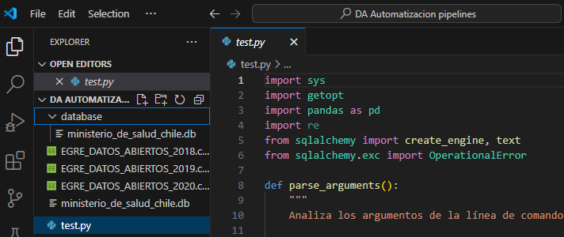
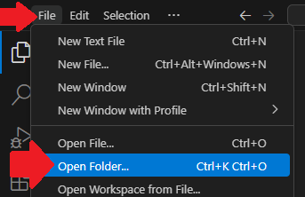

# Ejercicio: Pipelines - base de datos del Ministerio de Salud de Chile

📅 **Actualizado en Julio 2025**  
👩‍🏫 Por Instructora: **Irene Reynoso**  
📚 S12 Automatización: *Crear un Script de Pipeline*

---

Este ejercicio simula un proceso automatizado donde, al ejecutar el código con un nuevo conjunto de datos, **la información se agrega a una base de datos** (archivo `.db`).

El código:
- **Verifica automáticamente** que no se dupliquen registros.
- **Agrega la información nueva** a la base de datos.

> 🧩 Para visualizar la base de datos `.db` en Visual Studio, se puede instalar una extensión como **Local AstroDB Viewer** u otra similar.
---
## 🛠️ Procedimiento
1. En la carpeta donde se va a trabajar, crear una subcarpeta vacía llamada `database`.
   - > Aquí se generará automáticamente el archivo de base de datos.
2. Descargar los archivos `.csv` y colocarlos en la misma carpeta donde estara el script de python ** (afuera de la carpeta `database`).
--- 
## 📌 Errores comunes y soluciones
### ⁉️ Error: "unable to open databse file"
El problema es que no encuentra la carpeta database, mencionada en el código: 
- `engine = create_db_engine('database/ministerio_de_salud_chile.db')`

💡 Solución:
- Asegúrate de que exista una carpeta llamada `database` en el mismo directorio del script.
- Si no existe, créala vacía.

### ⁉️ Error: "no such table: NOMBRE_TABLA"
Esto sucede si VS Code no encuentra los archivos que intentas agregar.

💡 Solución:
- Verifica que los archivos `.csv` estén en la misma carpeta donde se ejecuta el código.

Usa el siguiente comando desde la terminal, cambiando el nombre del archivo según sea necesario:
`python test.py -f nombre_archivo.csv`

### ⁉️ Instalar o actualizar librerias
Si ves errores relacionados con pandas o sqlalchemy, asegúrate de tenerlas instaladas y actualizadas:
- `pip install pandas sqlalchemy`
- `pip install --upgrade pandas`

## 💬 Mensajes para explicar via Discord

Hola! aquí te explico un poco de este ejercicio

Este ejercicio representa un proceso donde cada vez que se ejecuta el codigo con un nuevo conjunto de datos, esta nueva información se agrega a la base de datos (archivo con terminación `.db`)

El código procesa esta nueva información (verifica que no se dupliquen datos) de forma automatizada y después la agrega a la base de datos.

Como hacemos esto?
- primero, en VS Code, nos posicionamos en la carpeta donde vayamos a trabajar
- en esta carpeta, guardamos los archivos `.csv` que vamos a ir agregando a la base de datos 
- después, en esta misma carpeta, creamos una carpeta vacía llamada `database` (eventualmente aquí se va a generar un archivo para la base de datos)
  - si no creamos esta carpeta, el código sugerido no va a funcionar pues en la linea `engine = create_db_engine('database/ministerio_de_salud_chile.db')` estamos referenciando a esta carpeta

ya que tengamos lo anterior, podemos pasar a ejecutar el código:
- cuando uses el comando en la terminal, hay que ir cambiando la ruta, según el nombre del archivo que se quiera agregar:
  -  `python test.py -f nombre_archivo.csv`

## Pre-mensaje: Preparación inicial
tienes una carpeta creada para este proyecto? 
en caso de que no, hay que crearla
- puedes crearla en tus documentos, donde guardes lo referente al curso, creamos una carpeta para este ejercicio

ya que la tengas lista, la abrimos desde vs code
