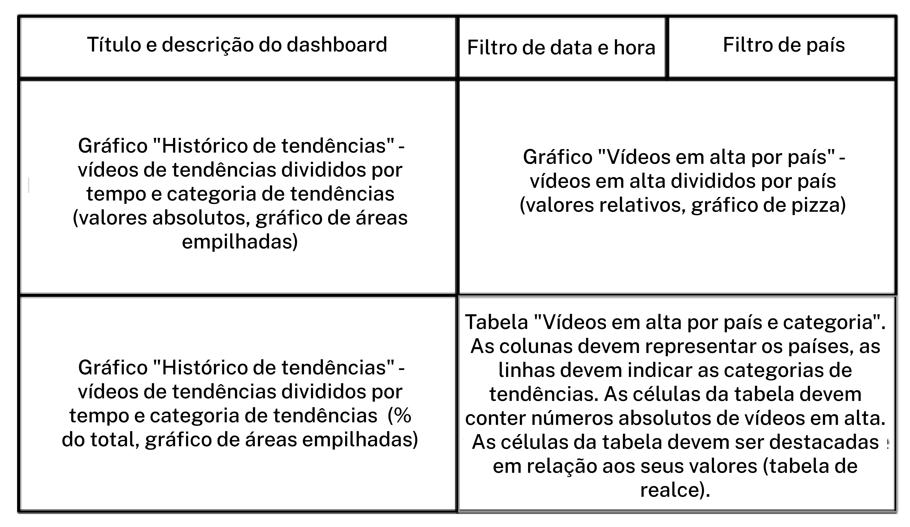
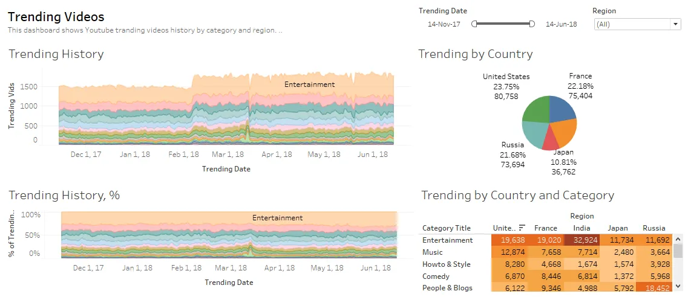

# Sprint 12: Automação

### Construindo o dashboard

- O filtro de data e hora e o filtro de país devem modificar todos os gráficos do dashboard. - Observe que os gráficos de histórico de interação "Histórico de tendências" e "Histórico de tendências, %" devem ter data e hora ao longo do eixo X. 
- "Histórico de tendências" deve ter o número de vídeos na seção de tendências (o campo `videos_count` ) ao longo do eixo Y, e o outro gráfico deve ter a porcentagem lá.

### Exemplo Dashboard

https://public.tableau.com/profile/vyacheslav.zotov#!/vizhome/StandardEng/Trending?publish=yes