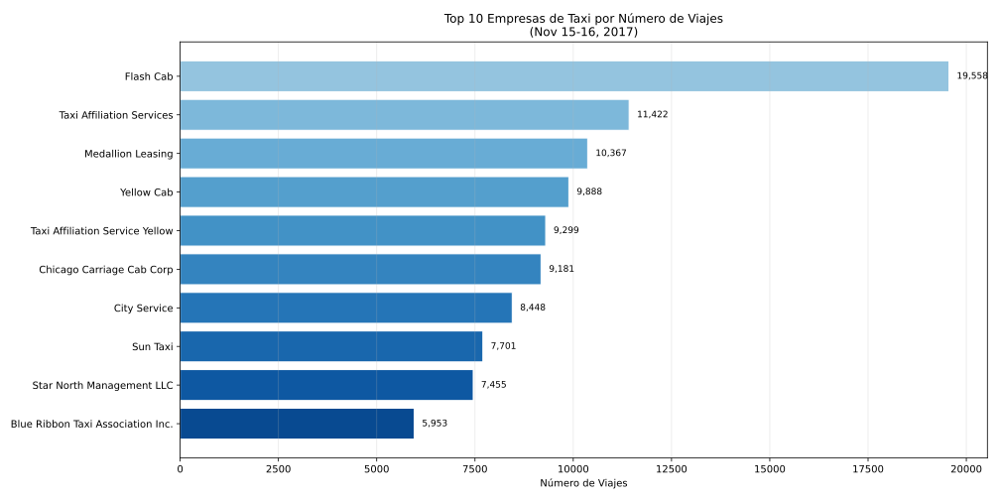
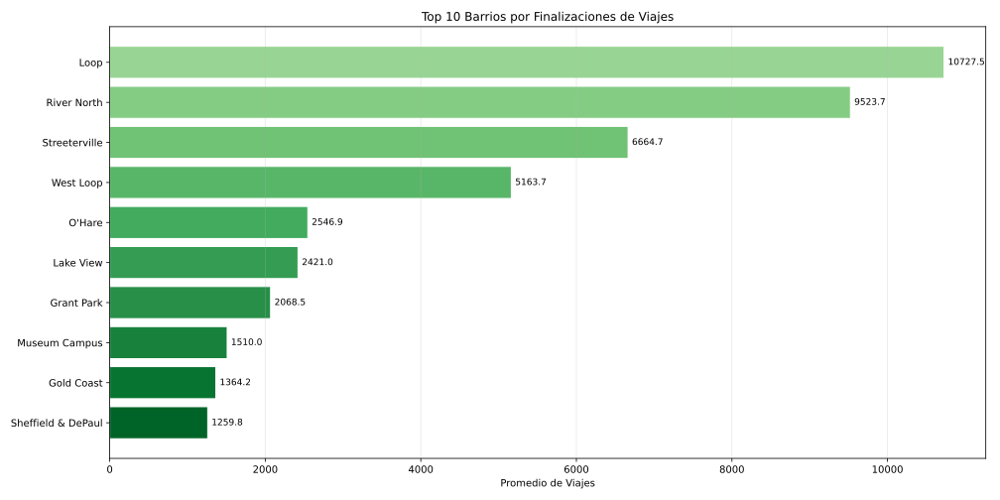
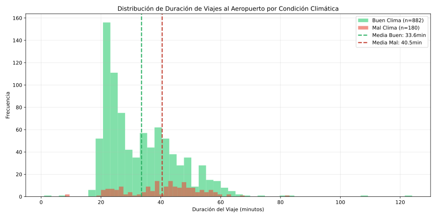
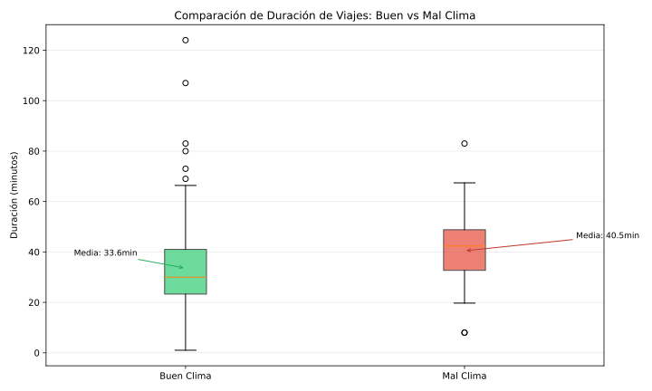
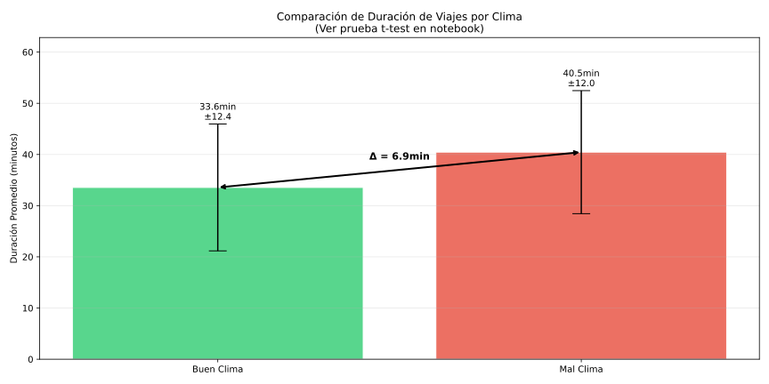

# Criterios de Evaluación: Proyecto 8 — SQL y Análisis de Taxis (Chicago)

## Objetivo

Analizar datos de viajes en taxi en Chicago (extraídos mediante SQL) para identificar patrones de uso, las empresas y barrios más populares, y probar la hipótesis de que la duración promedio de los viajes cambia los sábados lluviosos.

**Requisitos previos**: Completar SP1-SP6 (Python, pandas, visualizaciones, pruebas de hipótesis), conocimientos básicos de SQL.

**Competencias que desarrollarás**: Carga y exploración de datos de consultas SQL, limpieza de datos (duplicados, valores cero), análisis exploratorio, visualizaciones comparativas, prueba de hipótesis (Levene + t-test), interpretación de resultados estadísticos

<details>
<summary>Task Statement</summary>

## Descripción del proyecto

Trabajas como analista para Zuber, una nueva empresa de viajes compartidos en Chicago. Tu tarea es encontrar patrones en la información disponible, comprender las preferencias de los pasajeros y el impacto de factores externos (como el clima) en los viajes.

Los datos provienen de consultas SQL previamente ejecutadas y guardadas en archivos CSV.

## Instrucciones del proyecto

1. **Cargar y explorar los datos:**
   - Cargar los 3 archivos CSV resultantes de las consultas SQL
   - Revisar tipos de datos
   - Identificar duplicados y valores faltantes

2. **Limpiar los datos:**
   - Convertir fechas a datetime
   - Manejar viajes con duración 0 segundos
   - Normalizar nombres de empresas y ubicaciones

3. **Análisis exploratorio:**
   - Top 10 empresas de taxi por número de viajes
   - Top 10 barrios por finalizaciones de viajes
   - Visualizar con gráficos de barras

4. **Prueba de hipótesis:**
   - H₀: La duración promedio de viajes no cambia los sábados lluviosos
   - H₁: La duración promedio de viajes cambia los sábados lluviosos
   - Aplicar prueba de Levene y t-test

## Descripción de los datos

**project_sql_result_01.csv** (empresas de taxi):
- `company_name`: nombre de la empresa de taxi
- `trips_amount`: número de viajes (15-16 de noviembre 2017)

**project_sql_result_04.csv** (barrios):
- `dropoff_location_name`: nombre del barrio de destino
- `average_trips`: promedio de viajes que terminan en ese barrio

**project_sql_result_07.csv** (viajes al aeropuerto):
- `start_ts`: fecha y hora de inicio del viaje
- `weather_conditions`: condiciones climáticas (Good/Bad)
- `duration_seconds`: duración del viaje en segundos

</details>

## Glosario de Términos Técnicos

**SQL**: Lenguaje de consulta estructurado para bases de datos relacionales.

**CSV**: Formato de archivo de valores separados por comas, común para almacenar datos tabulares.

**Loop**: Barrio central de Chicago, zona de negocios y comercio.

**O'Hare**: Aeropuerto Internacional O'Hare, uno de los más transitados de EE.UU.

**Prueba de Levene**: Prueba estadística para verificar si las varianzas de dos grupos son iguales antes de aplicar t-test.

**t-test (ttest_ind)**: Prueba estadística para comparar las medias de dos grupos independientes.

**equal_var**: Parámetro del t-test que indica si asumir varianzas iguales (True) o usar prueba de Welch (False).

**dayofweek**: Atributo de datetime que retorna el día de la semana (0=lunes, 5=sábado, 6=domingo).

**datetime**: Tipo de dato para representar fechas y horas en pandas.

**Duplicados explícitos**: Filas completamente idénticas en todas sus columnas.

**Duplicados implícitos**: Valores que representan lo mismo pero escritos de forma diferente.

## Rúbrica de Evaluación - Checklist para Revisores

### BÁSICO

**Carga de Datos**
- [ ] **[OBLIGATORIO]** Carga correctamente los 3 archivos CSV
- [ ] **[OBLIGATORIO]** Examina cada DataFrame con info() y head()
- [ ] Usa describe() para ver estadísticas básicas
- [ ] Identifica tipos de datos incorrectos

**Revisión de Datos**
- [ ] **[OBLIGATORIO]** Verifica duplicados en cada DataFrame
- [ ] **[OBLIGATORIO]** Verifica valores nulos
- [ ] Documenta observaciones sobre los datos

**Estructura del Código**
- [ ] **[OBLIGATORIO]** El código ejecuta sin errores
- [ ] **[OBLIGATORIO]** Todas las celdas están ejecutadas secuencialmente

<details>
<summary>📊 Resultados Esperados - BÁSICO</summary>

**Tamaño de los DataFrames:**
- `df_companies`: 64 filas (empresas de taxi)
- `df_neighborhoods`: 94 filas (barrios)
- `df_airport`: 1,068 filas (viajes al aeropuerto)

**Tipos de datos iniciales:**
- `start_ts`: object (debe convertirse a datetime)
- `weather_conditions`: object (Good/Bad)
- `duration_seconds`: int64

**Valores nulos:** Ninguno en los 3 DataFrames

**Código de carga:**
```python
df_companies = pd.read_csv('/datasets/project_sql_result_01.csv')
df_neighborhoods = pd.read_csv('/datasets/project_sql_result_04.csv')
df_airport = pd.read_csv('/datasets/project_sql_result_07.csv')

print(df_companies.info())
print(df_companies.head())
```

</details>

### INTERMEDIO

**Limpieza de Datos**
- [ ] **[OBLIGATORIO]** Convierte start_ts a tipo datetime
- [ ] **[OBLIGATORIO]** Identifica y maneja viajes con duration_seconds = 0
- [ ] Normaliza nombres (minúsculas, strip) para detectar duplicados implícitos
- [ ] Justifica decisión sobre duplicados en df_to_airport

**Análisis de Empresas**
- [ ] **[OBLIGATORIO]** Identifica top 10 empresas por número de viajes
- [ ] **[OBLIGATORIO]** Crea gráfico de barras de empresas
- [ ] Calcula porcentaje de mercado de las empresas principales
- [ ] Interpreta qué empresa lidera el mercado

**Análisis de Barrios**
- [ ] **[OBLIGATORIO]** Identifica top 10 barrios por finalizaciones
- [ ] **[OBLIGATORIO]** Crea gráfico de barras de barrios
- [ ] Interpreta por qué ciertos barrios son más populares
- [ ] Relaciona con características de Chicago (Loop = centro, O'Hare = aeropuerto)

**Visualizaciones**
- [ ] **[OBLIGATORIO]** Los gráficos tienen títulos descriptivos
- [ ] **[OBLIGATORIO]** Los ejes tienen etiquetas claras
- [ ] Usa rotación en etiquetas cuando es necesario
- [ ] Aplica paleta de colores apropiada

<details>
<summary>📊 Resultados Esperados - INTERMEDIO</summary>

**Limpieza de Datos:**
- Viajes con `duration_seconds = 0`: **6 viajes** (deben eliminarse o documentarse)
- Después de filtrar: **1,062 viajes válidos**
- Todos los viajes son de sábados (`dayofweek == 5`)

**Conversión de fecha:**
```python
df_airport['start_ts'] = pd.to_datetime(df_airport['start_ts'])
df_airport['day_of_week'] = df_airport['start_ts'].dt.dayofweek
```

---

**Top 10 Empresas de Taxi:**



| Empresa | Viajes | % del Total |
|---------|--------|-------------|
| Flash Cab | 19,558 | 14.24% |
| Taxi Affiliation Services | 11,422 | 8.32% |
| Medallion Leasing | 10,367 | 7.55% |
| Yellow Cab | 9,888 | 7.20% |
| Taxi Affiliation Service Yellow | 9,299 | 6.77% |
| Chicago Carriage Cab Corp | 9,181 | 6.69% |
| City Service | 8,448 | 6.15% |
| Sun Taxi | 7,701 | 5.61% |
| Star North Management LLC | 7,455 | 5.43% |
| Blue Ribbon Taxi Association | 5,953 | 4.34% |

**Total viajes todas las empresas:** 137,311

---

**Top 10 Barrios (Destinos):**



| Barrio | Viajes Promedio | Contexto |
|--------|-----------------|----------|
| Loop | 10,727.47 | Centro financiero de Chicago |
| River North | 9,523.67 | Zona de entretenimiento/restaurantes |
| Streeterville | 6,664.67 | Área turística junto al lago |
| West Loop | 5,163.67 | Zona de restaurantes/tech |
| O'Hare | 2,546.90 | Aeropuerto internacional |
| Lake View | 2,420.97 | Barrio residencial popular |
| Grant Park | 2,068.53 | Parque principal/eventos |
| Museum Campus | 1,510.00 | Zona de museos |
| Gold Coast | 1,364.23 | Barrio lujoso |
| Sheffield & DePaul | 1,259.77 | Área universitaria |

</details>

### AVANZADO

**Preparación para Hipótesis**
- [ ] **[OBLIGATORIO]** Filtra solo datos de sábados
- [ ] **[OBLIGATORIO]** Separa datos por condición climática (Good/Bad)
- [ ] Verifica que los datos filtrados corresponden a sábados
- [ ] Calcula duración promedio para cada grupo

**Prueba de Levene**
- [ ] **[OBLIGATORIO]** Aplica prueba de Levene para verificar igualdad de varianzas
- [ ] Interpreta resultado de Levene (¿usar equal_var=True o False?)
- [ ] Documenta decisión basada en resultado

**Prueba t-test**
- [ ] **[OBLIGATORIO]** Formula H₀ (no hay diferencia) y H₁ (sí hay diferencia)
- [ ] **[OBLIGATORIO]** Define nivel de significancia (alpha = 0.05)
- [ ] **[OBLIGATORIO]** Aplica ttest_ind con equal_var correcto
- [ ] **[OBLIGATORIO]** Interpreta valor p correctamente
- [ ] Concluye si se rechaza o no H₀

**Conclusiones**
- [ ] **[OBLIGATORIO]** Presenta conclusiones sobre el impacto del clima
- [ ] Relaciona hallazgos con lógica real (tráfico, seguridad)
- [ ] Resume hallazgos sobre empresas y barrios
- [ ] Proporciona recomendaciones basadas en el análisis

<details>
<summary>📊 Resultados Esperados - AVANZADO (Prueba de Hipótesis)</summary>

**Distribución por Condición Climática:**



| Condición | n | Media | Desv. Estándar |
|-----------|---|-------|----------------|
| Buen clima | 882 | 33.55 min | 12.39 min |
| Mal clima | 180 | 40.45 min | 12.02 min |
| **Diferencia** | - | **+6.90 min** | - |

---

**Comparación Visual:**



---

**Prueba de Levene (Igualdad de Varianzas):**
```python
from scipy.stats import levene

stat, p_value = levene(df_bad['duration_seconds'], df_good['duration_seconds'])
# Estadístico: ~0.14
# Valor p: ~0.71
```

**Interpretación Levene:** p > 0.05 → No rechazamos H₀ de igualdad de varianzas → Usar `equal_var=True`

---

**Prueba t-test:**
```python
from scipy.stats import ttest_ind

alpha = 0.05
t_stat, p_value = ttest_ind(
    df_bad['duration_seconds'],
    df_good['duration_seconds'],
    equal_var=True
)
```

**Resultados esperados:**
- Estadístico t: ~6.67
- Valor p: ~4.29e-11 (prácticamente 0)

---

**Visualización de Hipótesis:**



---

**Conclusión:**
- **H₀:** No hay diferencia en duración promedio entre sábados con buen y mal clima
- **H₁:** Hay diferencia significativa en la duración promedio
- **α = 0.05**

**Decisión:** Rechazamos H₀ (p << 0.05)

**Interpretación:** La duración promedio de los viajes al aeropuerto **SÍ cambia significativamente** los sábados con mal clima. Los viajes son aproximadamente **7 minutos más largos** cuando hay mal tiempo, probablemente debido a:
- Tráfico más lento por condiciones de visibilidad
- Conductores manejando con más precaución
- Mayor congestión por accidentes relacionados con el clima

</details>

## Criterios de Aprobación General

**Niveles de aprobación:**

- **BÁSICO (Aprobado mínimo)**:
  - Todos los criterios OBLIGATORIOS de BÁSICO: 7/7
  - Al menos 2 criterios adicionales de los no obligatorios

- **INTERMEDIO (Aprobado satisfactorio)**:
  - Todos los criterios OBLIGATORIOS: 15/15
  - Al menos 6 criterios adicionales de los no obligatorios

- **AVANZADO (Aprobado con distinción)**:
  - Todos los criterios OBLIGATORIOS: 24/24
  - Al menos 10 criterios adicionales de los no obligatorios

## Ejemplos de Código

> **Nota:** Todos los imports deben estar en la primera celda del notebook.

**Primera celda (imports):**
```python
import pandas as pd
import matplotlib.pyplot as plt
from scipy import stats
from scipy.stats import levene, ttest_ind
```

**Carga de datos:**
```python
df_trips = pd.read_csv('/datasets/project_sql_result_01.csv')
df_location = pd.read_csv('/datasets/project_sql_result_04.csv')
df_to_airport = pd.read_csv('/datasets/project_sql_result_07.csv')
```

**Conversión de fecha:**
```python
df_to_airport['start_ts'] = pd.to_datetime(df_to_airport['start_ts'])
```

**Identificación de viajes con duración 0:**
```python
zero_duration = (df_to_airport['duration_seconds'] == 0).sum()
print(f"Viajes con duración 0: {zero_duration}")

df_to_airport = df_to_airport[df_to_airport['duration_seconds'] != 0]
```

**Top 10 empresas de taxi:**
```python
top10_companies = df_trips.sort_values(by='trips_amount', ascending=False).head(10)

plt.figure(figsize=(12, 6))
plt.barh(top10_companies['company_name'][::-1], top10_companies['trips_amount'][::-1])
plt.title('Top 10 Empresas de Taxi por Número de Viajes')
plt.xlabel('Número de Viajes')
plt.tight_layout()
plt.show()
```

**Filtrar por condición climática:**
```python
df_to_airport['day_of_week'] = df_to_airport['start_ts'].dt.dayofweek

df_good = df_to_airport[df_to_airport['weather_conditions'] == 'Good']
df_bad = df_to_airport[df_to_airport['weather_conditions'] == 'Bad']

print(f"Promedio buen clima: {df_good['duration_seconds'].mean():.2f} segundos")
print(f"Promedio mal clima: {df_bad['duration_seconds'].mean():.2f} segundos")
```

**Prueba de Levene:**
```python
stat, p_value = levene(df_bad['duration_seconds'], df_good['duration_seconds'])
print(f'Estadístico de Levene: {stat:.4f}')
print(f'Valor p: {p_value:.4f}')

equal_var = p_value >= 0.05
print(f"Usar equal_var={equal_var}")
```

**Prueba t-test:**
```python
alpha = 0.05

t_stat, p_value = ttest_ind(
    df_bad['duration_seconds'],
    df_good['duration_seconds'],
    equal_var=True
)

print(f"Estadístico t: {t_stat:.4f}")
print(f"Valor p: {p_value:.10f}")

if p_value < alpha:
    print("Rechazamos H₀: la duración promedio SÍ cambia los sábados lluviosos")
else:
    print("No rechazamos H₀: no hay evidencia de diferencia significativa")
```

## Criterios de Descalificación

**Errores Críticos que descalifican automáticamente:**
- Notebook con celdas sin ejecutar
- Imports dispersos en el notebook (todos los imports deben estar en la primera celda)
- No carga los 3 archivos CSV
- No convierte start_ts a datetime
- No crea visualizaciones de empresas o barrios
- No formula H₀ y H₁
- No aplica prueba t-test
- No interpreta el valor p
- Código genera errores de sintaxis sin corregir
- No presenta conclusiones
- Plagio o copia directa sin comprensión

## Errores Frecuentes

*Esta sección identifica los errores más comunes observados en este proyecto.*

### Errores en Limpieza de Datos

1. **No convertir start_ts a datetime:**
   - Incorrecto: Dejar como string/object
   - Correcto: `pd.to_datetime(df['start_ts'])`
   - Consecuencia: No se puede extraer día de la semana

2. **No manejar viajes con duration_seconds = 0:**
   - Incorrecto: Incluir viajes con duración 0 en el análisis
   - Correcto: Eliminar o documentar decisión de mantenerlos
   - Consecuencia: Sesgo en cálculo de promedios

3. **Eliminar duplicados sin justificación:**
   - Incorrecto: `df.drop_duplicates()` automáticamente en df_to_airport
   - Correcto: Documentar que sin trip_id no se puede confirmar si son duplicados reales
   - Consecuencia: Posible pérdida de datos válidos

### Errores en Filtrado de Sábados

4. **Filtrar día incorrecto:**
   - Incorrecto: `df['start_ts'].dt.dayofweek == 6` (domingo)
   - Correcto: `df['start_ts'].dt.dayofweek == 5` (sábado)
   - Consecuencia: Análisis con datos del día incorrecto

5. **Usar day_name() sin verificar idioma:**
   - Incorrecto: `df['day_of_week'] == 'Sábado'` en sistema en inglés
   - Correcto: `df['day_of_week'] == 'Saturday'` o usar dayofweek
   - Consecuencia: Filtro vacío

### Errores en Prueba de Levene

6. **No aplicar prueba de Levene:**
   - Incorrecto: Asumir varianzas iguales sin verificar
   - Correcto: Aplicar Levene y decidir equal_var basado en resultado
   - Consecuencia: Uso incorrecto de t-test

7. **Interpretar Levene al revés:**
   - Incorrecto: p < 0.05 → varianzas iguales
   - Correcto: p < 0.05 → varianzas diferentes (rechazar H₀ de igualdad)
   - Consecuencia: Usar equal_var incorrecto en t-test

### Errores en Prueba t-test

8. **No definir alpha antes de la prueba:**
   - Incorrecto: Decidir alpha después de ver el p-value
   - Correcto: `alpha = 0.05` definido antes de calcular
   - Consecuencia: Sesgo en interpretación (p-hacking)

9. **Usar equal_var incorrecto:**
   - Incorrecto: `equal_var=True` cuando Levene indica varianzas diferentes
   - Correcto: Usar resultado de Levene para decidir
   - Consecuencia: Resultado estadístico potencialmente incorrecto

10. **Interpretar p-value al revés:**
    - Incorrecto: "p < 0.05, no hay diferencia significativa"
    - Correcto: "p < 0.05, rechazamos H₀, SÍ hay diferencia significativa"
    - Consecuencia: Conclusión opuesta a la correcta

### Errores en Visualizaciones

11. **Gráfico de barras sin ordenar:**
    - Incorrecto: Mostrar empresas en orden alfabético
    - Correcto: Ordenar por número de viajes (descendente)
    - Consecuencia: Difícil identificar líderes del mercado

12. **Etiquetas ilegibles:**
    - Incorrecto: Nombres de empresas horizontales (se superponen)
    - Correcto: `plt.xticks(rotation=45, ha='right')` o gráfico horizontal
    - Consecuencia: Gráfico difícil de leer

### Errores en Conclusiones

13. **No conectar clima con duración:**
    - Incorrecto: Solo reportar que hay diferencia
    - Correcto: Explicar por qué (tráfico, seguridad, visibilidad)
    - Consecuencia: Análisis sin valor práctico

14. **No mencionar líderes del mercado:**
    - Incorrecto: Solo mostrar gráfico sin interpretación
    - Correcto: "Flash Cab lidera con 14.24% del mercado"
    - Consecuencia: Insights no extraídos de los datos

15. **No relacionar barrios con geografía de Chicago:**
    - Incorrecto: "Loop tiene más viajes"
    - Correcto: "Loop es el centro financiero de Chicago, por eso tiene más destinos"
    - Consecuencia: Falta de contexto en las conclusiones

**Formulario de Feedback**: [TBD - Google Form](enlace-por-definir)
