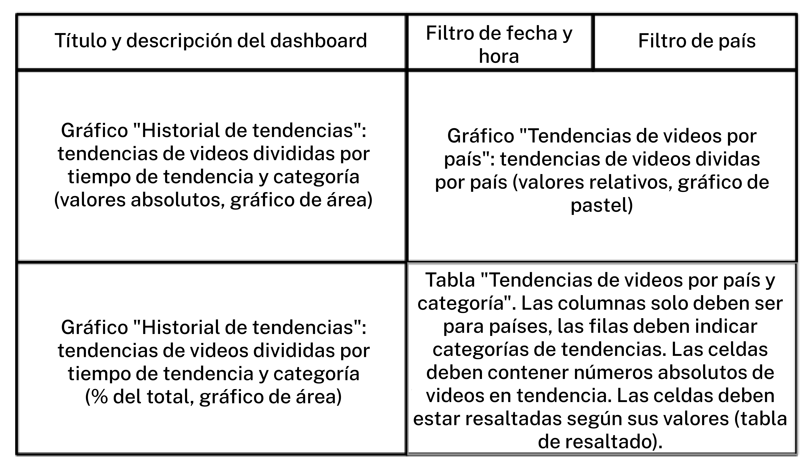

# Sprint 12: Automatización

### Crear el Dashboard

- El filtro de fecha y hora y el de país debería modificar todos los gráficos del dashboard. 
- Fíjate que los gráficos de historial de interacción "Historial de tendencias" e "Historial de tendencias, %" deben tener fecha y hora en el eje X.
- "Historial de tendencias" debería tener el número de videos en la sección de tendencias (el campo videos_count) en el eje Y y el otro gráfico debería tener el porcentaje ahí.

### Ejemplo Dashboard

https://public.tableau.com/profile/vyacheslav.zotov#!/vizhome/StandardEng/Trending?publish=yes