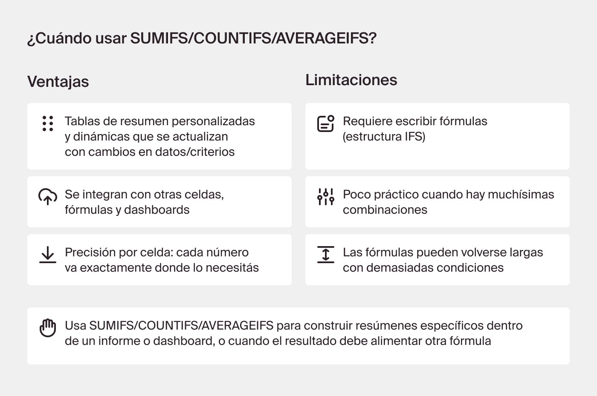
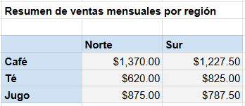
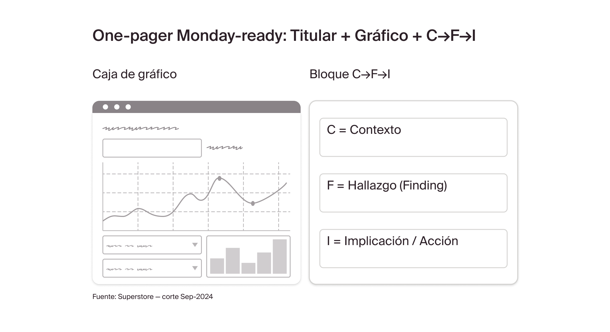

# Sprint 2: Transformar datos para insights de negocio
🗓️ Fecha de creación: 10 septiembre 2025  
🗓️ Fecha de actualización: 8 octubre 2025  

---
## Capitulo 1: Preguntas analíticas en contexto de negocio
### C1 - Lección 1: Formular preguntas a partir del negocio

Cómo identificar y priorizar Stakeholders
- Decisión – “¿Qué necesitas decidir exactamente con estos datos?”
- Plazo – “¿Para cuándo debes tener la respuesta?”
- Involucrados – “¿Quién más participa o puede bloquear/impulsar la acción?”   
  
**1. Definir Tarea:** Definir el éxito antes de medir  
- ¿Cuál es la meta concreta? → Identificar el canal que más vende Accesorios en Primavera–Verano para redirigir presupuesto.
- ¿Cómo se mide ese éxito? → Ventas netas y ticket promedio por canal.
- ¿Cuál es la ruta de medición? → Históricos mar–ago 2025 y entrega antes de la reunión del miércoles.

**2. Plantea la tarea:** Mini-Framework 4Q (Qué, Cuánto, Cuándo, Quién)  
- ¿Cómo varió `[métrica -qué-]` en `[dimensión-cuánto ]` durante `[periodo -cuándo-]` para ayudar a `[stakeholder -quién-]` a decidir?`

**3 Selecciona los datos:** Definir qué campos del conjunto de datos se van a usar

Guía rápida
1. Parte del objetivo → escoger canal líder.
2. Define la decisión → aumentar o recortar inversión.
3. Elige las dimensiones relevantes → canal, fecha, categoría.
4. Verifica que los datos existan: si faltan, ajusta la pregunta.
  

### C1 - Lección 2: Vincular preguntas con métricas clave

Una **métrica** es un cálculo que transforma datos aislados en información útil 
- Ejemplo métrica absoluta: Total  
- Ejemplos métricas relativas: Promedios, Crecimiento, ratio, variación, percentil, etc. 
  

KPIs y OKR
- El Objetivo (O) marca hacia dónde queremos ir.
- Los Resultados Clave (KRs) miden si lo estamos logrando.
- Y esos KRs se cuantifican con KPIs, es decir, métricas específicas (absolutas o relativas).

🎯 Los OKR definen los objetivos estratégicos, y los KPI permiten monitorear si se están cumpliendo.
  

KPIs vs. Guardrails (métricas de control)
- Guardrails: métricas de control que se monitorean en paralelo a los KPIs para alertar sobre posibles problemas para el negocio. 

💡 Los KPIs dicen si avanzas, los guardrails se aseguran de que avances sin generar un problema mayor.
  

Términos clave
- **Crecimiento** (MoM/YoY): Cambio entre dos periodos.
- **KPI**: Métrica clave ligada a un objetivo con umbral y frecuencia.
- **Métrica**: Cálculo que resume o compara datos.
- **Promedio**: Representa el desempeño típico.
- **Ratio**: Relación entre dos valores; mide eficiencia o proporción.
- **Valor absoluto vs. relativo**: Tamaño total vs. eficiencia o tendencia.

  

### C1 - Lección 3: Indicadores que predicen y confirman

Dos tipos de métricas:
- **Indicadores lagging** → miden el resultado final, no puedes cambiarlo. Por ejemplo, las ventas logradas al cierre del trimestre.
- **Indicadores leading** → actúan como palancas de cambio porque se pueden influir a diario, mide para decidir si se cambia algo, para obtener un mejor resultado final. Por ejemplo, el número de clientes saludados personalmente en tienda, que según el libro antecede a un aumento en las ventas.

  

### C1 - Lección 4: Usar LLMs para el análisis de stakeholders y métricas

LLMs como aliados: Utiliza la IA
- como Subject Matter Expert (SME): pide explicación sobre conceptos desconocidos
- para construir una pregunta 4Q 
- como selector de métrica con guardrails en el prompt
- para generar las funciones de Google Sheets

💡 Diseña una vez, reutiliza siempre: guarda tus prompts SME, conversación 4Q y selector con guardrails para el próximo canal “caótico”.

   

---
## Capitulo 2: Preparar y explorar el dataset
### C2 - Lección 1: Cómo importar datos y unirlos con LEFT JOIN

- Importar un nuevo dataset: File > Import
- Explorando la estructura del conjunto de datos: Revisar encabezados, tipos de datos correctos, cantidad de renglones, etc.
- Comparando los datasets: identificar clave compartida, una columna que funciona como un “punto en común” que permite combinar la información de dos o más hojas de cálculo.   
💡 Regla de oro: si la clave no es única en la hoja de lookup (por ejemplo Tiendas), el join generará duplicados y métricas infladas.

Cómo unir las hojas de transactions y stores
- Tipos de JOIN: LEFT, RIGHT, INNER y FULL (en sheets, solo existe LEFT JOIN)

1. Tener los datos en un solo libro de sheets.
2. Posicionarse en una tabla/hoja, en columna nueva, escribe la formula de VLOOKUP. Syntax: 
`=VLOOKUP(search_key, range, index, [is_sorted])`
2. Revisa algunas filas al azar para confirmar que los datos sean correctos.
  

**Ejercicio** -  
- Datos crudos (cualquier persona con el link puede ver):
  - [stores.csv](https://drive.google.com/file/d/1UajQdAnrhWP19uBnWIRM7BxZBZPM-96H/view?usp=sharing)
  - [transactions.csv](https://drive.google.com/file/d/1Ei3CKnP7LPLb2aqrygVzyqE7s7fnOCx_/view?usp=sharing)
- Ejercicio resuelto (aparece en la plataforma, cualquier persona con el link puede ver): https://docs.google.com/spreadsheets/d/1wnYElfJBinIjvNsZOlkn17k3BgG2YDWM1VLwRTGbTwI/edit?usp=sharing
  

### C2 - Lección 2: Cómo combinar datasets con XLOOKUP

- Tabla transaccional: cada fila representa una transacción individual, es decir, una venta específica.  
-  Tabla de consulta: también conocidos como tablas de lookup, no se repiten registros: simplemente se listan los valores únicos.

💡 Regla de oro: la tabla “larga” (transaccional) recibe la información de las tablas “cortas” (lookup).

Fórmulas comparadas:
- `=VLOOKUP(lo_que_busco (clave primaria), donde busco, número de columna a regresar, ¿coincidencia exacta?)`
  - Ejemplo`=VLOOKUP(B2, Productos!A:D, 3, FALSE)`
- `=XLOOKUP(lo_que_busco (clave primaria), dónde_busco, columna a regresar, [si_no_encuentra], [match_mode])`
  - Opciones de [match_mode]:
    - 0 → Coincidencia exacta (es el valor por defecto).
    - -1 → Coincidencia exacta o el siguiente menor.
    - 1 → Coincidencia exacta o el siguiente mayor.
    - 2 → Coincidencia con comodines ( o ?).
  - Ejemplo `=XLOOKUP(B2, Productos!A:A, Productos!C:C, "No existe")`   

**Ejercicio 1** - Mi Súper Almacén

Datos crudos (cualquier persona con el link puede ver):
- Tabla transaccional: [ventas.csv](https://drive.google.com/file/d/1IjzdM3J2ulxc22K01NDI2QoDgNOuc8Ev/view?usp=sharing)
- Tabla de consulta: [Productos.csv](https://drive.google.com/file/d/1taE0tQ8tErCaMxZ7RV_G0mg4LU4unzxK/view?usp=sharing)
- Tabla de consulta: [sucursales.csv](https://drive.google.com/file/d/1s5A0jVeMMk1wGorqGTVpFRLRC5_hXrt_/view?usp=sharing)  
  
Ejercicio resuelto: https://docs.google.com/spreadsheets/d/1bZGJNBsCFrxvNe8Di1TMK0g0Vm8anc6SaeAFnosLg-s/edit?usp=sharing   

**Ejercicio 2** - Ejercicios Aplicados – Facturación por categoría y región
Datos crudos (cualquier persona con el link puede ver):
- [ventas_2000.csv](https://drive.google.com/file/d/1EMjltVRbWv5I7n0X_Tpw838iFK7jJfsm/view?usp=sharing)
- productos_2000.csv
- sucursales_2000.csv

Ejercicio resuelto (cualquier persona de TT puede ver): https://docs.google.com/spreadsheets/d/1PIpZZkcKfjuAOgc57aW1derL2EOCPGcltrV3jDyEVek/edit?usp=sharing

No se han visto las tablas dinámicas, para responder el cuestionario, se pueden usar filtros.   

Recursos adicionales (Google Sheets)
- [Documentación oficial XLOOKUP](https://support.google.com/docs/answer/12405947)
  

### C2 - Lección 3: Cómo organizar hojas de cálculo para análisis
Crear un cuaderno limpio y profesional, con reglas claras y documentación mínima:
- Renombrar y colorear pestañas para identificarlas rápido.
  - Para renombrar: doble clic en nombre de la hoja
  - Para colorear: Clic derecho en nombre de la hoja > Cambiar color
- Escribir nombres claros en cada columna.
- Seguir una convención estándar de nombres (pestañas, columnas, rangos).
- Aplicar un código de colores para diferenciar tipos de datos (brutos, limpios, análisis).
- Incluir un README.
  -  un archivo README es una guía rápida para entender el proyecto: 
     -  qué información contiene cada dataset
     -  cómo fue procesada
     -  cuál es el objetivo del análisis
  

**Ejercicio** - Practica aplicada - Crea tu propio README - empresa Mi Che
- Ejercicio sin resolver (cualquier persona con el link puede ver): https://docs.google.com/spreadsheets/d/18pXwhiRwo7ZsV3F9EHudanjdnX9_Cria/edit?usp=sharing&rtpof=true&sd=true
- Ejercicio resuelto (cualquier persona de TT puede ver): https://docs.google.com/spreadsheets/d/1ZhEXh6oTxoc6VQOiHVEAbDSQydyEtQYp/edit?usp=sharing&ouid=105341058430000280825&rtpof=true&sd=true
  

### C2 - Lección 4: Cómo preparar datos categóricos para agrupar

Funciones de Limpieza:
| Paso | Fórmula | Original → Resultado |
|-----------|-----------|-----------|
| Quitar basura + espacios |  `=TRIM(CLEAN(A2))`        | `" Electronics "` → `"Electronics"`  |
| Capitalizar cada palabra | `=PROPER(TRIM(CLEAN(A2)))` | `"electronics"` → `"Electronics"`  |
| Mayúsculas globales      | `=UPPER(...)`              | `"Electronics"` → `"ELECTRONICS"` |
| Separar y tomar 1ᵉʳ ítem | `=INDEX(SPLIT(A2,"/"),1)`  | `"ELECTRONICS/COMPUTERS"` → `"ELECTRONICS"`  |
| Reemplazar cadena        | `=SUBSTITUTE(A2,"AND KITCHEN","")`  | `"HOME AND KITCHEN"` → `"HOME"` |
| Recodificar variantes    | `=SWITCH(A2,"NA","NO CATEGORY","N/A","NO CATEGORY",A2)`  | `"N/A"` → `"NO CATEGORY"`  |
| Todo-en-uno | `=UPPER(TRIM(CLEAN(SUBSTITUTE(A2,"AND KITCHEN",""))))`  | Limpieza completa  |

💡 Mentalidad clave: no limpies manualmente; diseña el proceso una vez y reutilízalo.

Plantilla reutilizable: 
- crea una hoja formuleada, cada vez que aparece mas info en los datos crudos, la plantilla corrige todo de forma automática.
- Protege las hojas para hacer la plantilla a prueba de errores: clic derecho > Proteger hoja
  

Quality Assurance checks (Control de Calidad)
- Nombrar rangos: seleccionar rango > Data (Datos) > Named ranges (Rangos con nombre) > poner nombre 
- Formato condicional: Seleccionar columna > Format > Conditional format rules
- Registrar cambios en la hoja README   

**Ejercicio** - Práctica aplicada
empresa Mi Che quiere conocer:  
Cual es la region con el mayor numero de ventas totales para todos los productos pertenecientes a dos unidades:  panadería y snacks
- Ejercicio sin resolver (cualquier persona con el link puede ver): https://docs.google.com/spreadsheets/d/15TfduxFqRFtP0uv7OR2w8aOmczq5Qb-f/edit?usp=sharing&ouid=105341058430000280825&rtpof=true&sd=true
- Ejercicio resuelto (cualquier persona de TT puede ver): https://docs.google.com/spreadsheets/d/132FpalCg8tI0_wKQ5IVjZXbZRy2xFnHJ/edit?usp=sharing&ouid=105341058430000280825&rtpof=true&sd=true

### C2 - Lección 5: Cómo usar LLMs para fórmulas y errores en hojas de cálculo

Detectar errores comunes en las fórmulas (#N/A, #NUM, #VALUE!).
- `#VALUE!`: cuando intentas operar con rangos incompatibles, tipos de dato distintos o inexistentes.
- `#N/A`: cuando la búsqueda no encuentra coincidencias.
- `#NUM!`: cuando una referencia apunta a una celda/columna fuera de Rango.  

El LLM ayuda a corregir problemas como fórmulas rotas o mejorar formulas existentes. Para ello, hay que redactar prompts claros para que el LLM corrija correctamente. Por ejemplo, en ChatGPT escribir un buen prompt e incluir: 
- una explicación detallada de tu problema
- la fórmula que estás usando
- los detalles del error que aparece o mejora que se desea hacer   

Documentar la causa y la solución en README
- crea un rastro de conocimiento
- sirven de guía y referencia: muestran cómo se planteó el problema, contexto y solución de la IA

   

---
## Capitulo 3: Resumir datos con funciones y filtros
### C3 - Lección 1: Filtrar y explorar patrones en los datos

💡 Un **filtro** permite mostrar solo las filas que cumplen con ciertos criterios que tú defines. Todo lo demás se oculta, lo que ayuda a ver patrones y tendencias mucho más rápido.
- Activar filtro: Clic en tabla > Clic en el icono de embudo o filtro en la barra de herramientas
- Filtrar la columna deseada: 
    - marca únicamente la categoría de interés
    - filtra por condición, por ejemplo un rango de fechas
Es posible filtrar diferentes columnas, para evaluar diferentes escenarios.
  

#### Visualizar patrones
Las visualizaciones dentro de la hoja nos permiten encontrar patrones de negocio de un vistazo.

- Mapas de Calor (Heatmaps): Asigna colores según los valores en tus datos
  - Seleccionar el rango > Menu Fórmato > Formato Condicional > Seleccionar Escala de Colores
- Barras de Datos (Stack Bar / Barras de Progreso en Celda): los gráficos en celdas (sparklines), rellenan las celdas con barras horizontales cuya longitud refleja el valor de cada dato.
  - Sintaxis: `SPARKLINE(datos, [opciones])`. 
  - Ejemplo: Gráfico de barras con color y tamaño `=SPARKLINE(A1:A10, {"charttype","bar"; "color","blue"; "max",100})`  
    - `"max",100` → define el valor máximo de referencia, se toma el valor 100 como tope para escalar todas las barras proporcionalmente.
  
    Tipos de graficos:
    - Línea `{"charttype","line"}`
    - Barra	`{"charttype","bar"}`
    - Columna `{"charttype","column"}`
    - Win/Loss `{"charttype","winloss"}`
  

**Ejercicio** - Práctica Individual - Ventas por producto en una región específica - Ventas Cafetería
- Ejercicio sin resolver (cualquier persona con el link puede ver): https://docs.google.com/spreadsheets/d/1jNrlAoN4UCTcI_V7T7w1DHCwAgb2Er83bgHi6gESmuI/edit?usp=sharing
- Ejercicio resuelto (cualquier persona de TT puede ver): https://docs.google.com/spreadsheets/d/1_YXQIyEoD-iwwTpp5xiqiZtAJpFg9_D9w7EPpVazdts/edit?usp=sharing   
💡 Pistas:
- Pregunta 1: menú de filtro > Filtrar por condición > Texto contiene "01/2024"
- Ejercicio 1: menú de filtro > Filtrar por condición > Valores entre "01/04/2024" y "30/06/2024"
- Ejercicio 2: menú de filtro > Filtrar por condición > Mayor a (Greater than) 65
  
Recursos adicionales (Google Sheets)
- [Documentación oficial  Sparkline](https://support.google.com/docs/answer/3093289?hl=es)   

### C3 - Lección 2: Funciones condicionales

Las funciones de agregación condicional te permiten sumar, contar o promediar valores solo si estos cumplen con una o más condiciones.
- `SUMIF` (SUMAR.SI): Suma si se cumple una condición
  - Sintaxis: `=SUMIF(rango_criterio, criterio, [rango_suma])`
    - rango criterio: columna donde está el elemento a buscar
    - criterio: lo que estamos buscando
    - rango_suma (opcional): la columna de los que queremos sumar, si no se especifica, toma "rango criterio"
  - Ejemplo: `=SUMIF(A2:A6, "Café*", B2:B6)`
    - El asterisco se usa como comodín, la fórmula sumará cualquier producto que empiece con la palabra `Café`.

- `COUNTIF` (CONTAR.SI): Cuenta si se cumple una condición
  - Sintaxis: `=COUNTIF(rango, criterio)`
    - rango: columna donde vamos a buscar
    - criterio: lo que queremos contar
  - Ejemplo: `=COUNTIF(C:C, "Té Verde")`
  - Ejemplo: `=COUNTIF(A:A,">18")` la condición van entre comillas

- `AVERAGEIF` (PROMEDIO.SI): Promedio si se cumple una condición
  - Sintaxis: `= AVERAGEIF(rango_criterio, criterio, [rango_promedio]))`    
    - rango criterio: columna donde está el elemento a buscar
    - criterio: lo que estamos buscando
    - rango_promedio (opcional): la columna de los que queremos promediar, si no se especifica, toma "rango criterio"
  - Ejemplo: `= AVERAGEIF(C:C, "Café Clásico", G:G)`   
  

Referencias en fórmulas  
**Referencia relativa**: Cuando copias o arrastras una fórmula hacia otras celdas, las referencias cambian automáticamente, ajusta la fórmula a la nueva posición.
- Ejemplo: si tienes `=A2+B2` en la fila 2 y la copias a la fila 3, automáticamente se convierte en `=A3+B3`.
Para que la referencia no cambie, se necesitan **referencias absolutas**.

👉 Referencia relativa (dinámica): `A2` → se adapta al mover la fórmula (`A3`, `A4`,…).  
👉 Referencia absoluta (fija): 
- `$A$2` → siempre apunta exactamente a la celda `A2`.
- `$A2` → fija la columna `A`, pero la fila cambia.
- `A$2` → fija la fila `2`, pero la columna cambia.   

💡 TIP: En Google Sheets, el atajo para fijar una celda o rango (poner los $ para referencias absolutas):
- Windows: F4
- Mac: ⌘ + T  
Cada vez que presionas el atajo mientras editas una referencia, va ciclando entre:
  - `A2` → relativo
  - `$A$2` → columna y fila fijas
  - `A$2` → fila fija
  - `$A2` → columna fija 

**Ejercicio** - Práctica Guiada: 
- Ejercicio sin resolver - mismo que lección anterior (cualquier persona con el link puede ver): https://docs.google.com/spreadsheets/d/1jNrlAoN4UCTcI_V7T7w1DHCwAgb2Er83bgHi6gESmuI/edit?usp=sharing
- Ejercicio resuelto (cualquier persona de TT puede ver):   

Recursos adicionales (Google Sheets)
- [SUMAR.SI (SUMIF)](https://support.google.com/docs/answer/3093583?hl=es)
  - más funciones, en misma página, barra de la derecha
- [CONTAR.SI (COUNTIF)](https://support.google.com/docs/answer/3093480?hl=es)
- [PROMEDIO.SI (AVERAGEIF)](https://support.google.com/docs/answer/3256529?hl=es-419)    
  
### C3 - Lección 3: Identificar datos “sucios”
Los registros suelen venir con errores de entrada, duplicados, valores fuera de rango o categorías mal escritas.

- **Duplicados**: registros que aparecen más de una vez en un conjunto de datos. Aparecen por errores de entrada, fallas en la importación o problemas en la recolección de datos.
  - Por ejemplo: `=COUNTIF($A$2:$A$100, A2) > 1` → cuenta cuántas veces aparece el valor de la celda A2 dentro del rango de A2 a A100. Importante: usa referencias absolutas en el rango para poder arrastrar la fórmula.
- **Outliers** o valores atípicos: dato que se aleja considerablemente del resto de valores. Aparecen porque alguien cometió un error al registrar la información o porque realmente hubo un evento poco común.
  - Es importante detectarlos porque pueden distorsionar los cálculos como el promedio.  

Encontrar Valores duplicados y outliers  
El formato condicional también permite cambiar el color de las celdas o del texto automáticamente si cumplen una condición.
- Seleccionar columna > Formato (Format) > Formato condicional (Conditional formatting)
- Escribir la fórmula: 
  - Resaltar valores duplicados: “La fórmula personalizada es” > `=COUNTIF($A$2:$A$101, A2) > 1`
  - Resaltar valores atípicos: “Mayor que” > escribir número sin sentido
- Selecciona un color de relleno

Valores inconsistentes o inesperados  
Datos que no coinciden con las categorías definidas  
Ejemplo, tenemos unicamente 4 regiones: Norte, Sur, Este y Oeste.  
Regla que resalte cualquier otro valor:
- Seleccionar columna > Formato (Format) > Formato condicional (Conditional formatting)
- “La fórmula personalizada es” > `=AND($E$2:$E$101<>"Sur", $E$2:$E$101<>"Norte", $E$2:$E$101<>"Este", $E$2:$E$101<>"Oeste")`
  - Si una celda en esta columna no es Sur y no es Norte y no es Este y no es Oeste, entonces márcala como error.
  - usamos el signo de pesos para indicar referencias absolutas   

**Ejercicio** Práctica guiada - Ejercicio 1: Valores Extremos - Ventas Cafetería   
**Ejercicio** Práctica Aplicada - Ejercicio 1: Análisis de datos y detección de errores  
- Ejercicio sin resolver (cualquier persona con el link puede ver): https://docs.google.com/spreadsheets/d/1jNrlAoN4UCTcI_V7T7w1DHCwAgb2Er83bgHi6gESmuI/edit?usp=sharing
- Ejercicio resuelto (cualquier persona de TT puede ver): https://docs.google.com/spreadsheets/d/1K_Kplc2xCtL0pYZnQiTEW1IrJqBmscEK5sXD07M0ys4/edit?usp=sharing
  - Valor no esta entre (Is not between) 0 y 180.
  - Fórmula personalizada: `=AND($D$2:$D$101<>"Té", $D$2:$D$101<>"Café", $D$2:$D$101<>"Jugo")`   

### C3 - Lección 4: Comparar segmentos con múltiples condiciones

Funciones de agregación condicional con múltiples condiciones  
- `SUMIFS` (SUMAR.SI.CONJUNTO): Suma si se cumplen múltiples condiciones:
  - Sintaxis: `SUMAR.SI.CONJUNTO(rango_suma; rango_criterios1; criterios1; [rango_criterios2; criterios2];...)`
  - Ejemplo: `SUMAR.SI.CONJUNTO(A2:A9;B2:B9;"=A*";C2:C9;"Juan")`

- `COUNTIFS` (CONTAR.SI.CONJUNTO)   
  - Sintaxis: `CONTAR.SI.CONJUNTO(rango_criterios1; criterios1; [rango_criterios2; criterios2];…)`
    - Ejemplo: `=CONTAR.SI.CONJUNTO(B:B;"=Sí"; D:D;"=Sí")`

-  `AVERAGEIFS` (PROMEDIO.SI.CONJUNTO):
   - Sintaxis: `PROMEDIO.SI.CONJUNTO(rango_promedio; rango_criterio1; criterio1; [rango_criterio2; criterio2]; ...)`
   - Ejemplo: `=PROMEDIO.SI.CONJUNTO(B2:B;B2:B;">=70";B2:B;"<=90")`
  

Tablas de resumen usando funciones
Ejemplo: 
- En las filas, los productos (Café Clásico, Café con Leche, Té Verde).
- En las columnas, las regiones (Norte, Sur, Oeste, Este).

Fórmula `=SUMIFS($G:$G, $C:$C, $J5, $E:$E, K$4)`
- `$G:$G` → Ventas Totales
- `$C:$C` → Productos
- `$J5` → fijamos columna J (productos) pero dejamos libre la fila, para poder arrastrar hacia abajo y cambiar el producto.
- `$E:$E` → Región
- `K$4` → fijamos la fila 4 (regiones) pero dejamos libre la columna, para poder arrastrar hacia la derecha y cambiar la región

Arrastrar la fórmula hacia la derecha, cambiará automáticamente la región.
Arrastrar hacia abajo, cambiará automáticamente el producto.
 

Ventas Totales
| Producto        | Norte | Sur   | Oeste | Este  |
|-----------------|-------|-------|-------|-------|
| Café Clásico    | 575   | 462.5 | 250   | 237.5 |
| Café con Leche  | 345   | 270   | 510   | 460   |
| Té Verde        | 0     | 80    | 0     | 705   |
  

¿Cuándo usar SUMIFS/COUNTIFS/AVERAGEIFS ?

**Ejercicio** - Ejercicio 1: Ventas por Región y Tipo de Producto
- Ejercicio sin resolver (cualquier persona con el link puede ver): https://docs.google.com/spreadsheets/d/1m_xfKbcCZTkbyT-dBRqYfo7t4j_MucMphzmczh7QBaM/edit?usp=sharing
- Ejercicio resuelto (cualquier persona de TT puede ver): https://docs.google.com/spreadsheets/d/1OqVf7HiqEXVACEp_57nGmHW3BAMXCesnRRzN_8ph0qo/edit?usp=sharing   

Recursos adicionales
- `SUMIFS` (SUMAR.SI.CONJUNTO):
  - [Google Sheets](https://support.google.com/docs/answer/3238496?hl=es)
  - [Microsoft Excel](https://support.microsoft.com/es-es/office/funci%C3%B3n-sumar-si-conjunto-c9e748f5-7ea7-455d-9406-611cebce642b)
- `COUNTIFS` (CONTAR.SI.CONJUNTO)
  - [Google Sheets](https://support.google.com/docs/answer/3256550?hl=es)
  - [Microsoft Excel](https://support.microsoft.com/es-es/office/funci%C3%B3n-contar-si-conjunto-dda3dc6e-f74e-4aee-88bc-aa8c2a866842)
- `AVERAGEIFS` (PROMEDIO.SI.CONJUNTO)
  - [Google Sheets](https://support.google.com/docs/answer/3256534?hl=es)
  - [Microsoft Excel](https://support.microsoft.com/es-es/office/funci%C3%B3n-promedio-si-conjunto-48910c45-1fc0-4389-a028-f7c5c3001690)
   

### C3 - Lección 5: Hojas resumen con métricas clave 

 Hoja de resumen dedicada:  
 "índice" o un "resumen ejecutivo" que muestra lo más importante
 - Claridad: Las métricas clave no se pierden entre un mar de datos.
 - Accesibilidad: Quien necesite la información importante, la encuentra de inmediato.
 - Profesionalismo: Muestra que tu análisis está bien estructurado.
 - Base para Reportes: Es el punto de partida ideal para copiar y pegar en un informe, o para crear gráficos.  

Formato básico para la legibilidad  
- Paso 1: Usa negritas para las etiquetas o encabezados
- Paso 2: Alinea tus columnas: números a la derecha y texto a la izquierda
- Paso 3: Aplica formato de número adecuado: moneda, porcentajes o quitar decimales a enteros.
- Paso 4: Considera encabezados y espacios: Usa una fila para un título general y deja filas o columnas en blanco para separar grupos de métricas.

  

La hoja resumen se puede reutilizar para:
- Reportes: todas las métricas en un solo lugar, listas para cualquier informe o presentación.
- Construir gráficos: mostrar tendencias, comparaciones o resultados de manera visual.
- Seguimiento interno de KPIs: monitorear indicadores críticos rápidamente.
- Dashboards interactivos: alimentar visualizaciones dinámicas que se actualizan en tiempo real.   

Adaptando la hoja de resumen a diferentes audiencias  
No le muestras lo mismo a todo el mundo. El nivel de detalle, el tipo de métricas y el lenguaje que usas deben adaptarse a quién está viendo el informe.   

**Ejercicio** -  Hoja de resumen de ventas regionales - Ventas Cafeterías
- Ejercicio sin resolver (cualquier persona con el link puede ver): https://docs.google.com/spreadsheets/d/1jNrlAoN4UCTcI_V7T7w1DHCwAgb2Er83bgHi6gESmuI/edit?usp=sharing
- Ejercicio resuelto (cualquier persona de TT puede ver):   
   

---
## Capitulo 4: Analizar datos con tablas dinámicas
### C4 - Lección 1: Cómo crear tu primera tabla dinámica

Una tabla dinámica o PivotTable es una herramienta que permite resumir, agrupar y reorganizar datos de forma automática e interactiva.

Creando una tabla dinámica
1. Datos limpios: sin filas en blanco, encabezados únicos y tipos de datos correctos.
2. Insertar la tabla dinámica: Seleccionamos datos > Menu: Insertar (Insert)> Tabla dinámica (Pivot Table) > nueva hoja.  
  
Editor de tabla dinámica (Pivot table editor):
- Filas (Rows): filas de la tabla, primera forma en que quieres agrupar tus datos.
- Columnas (Columns): encabezados de las columnas, segunda forma de agrupar, creando así un resumen cruzado.
- Valores (Values): campo que quieres resumir. Por ejemplo: "Ventas Totales", resumirlas por: SUMA, PROMEDIO, CONTEO, MÁXIMO, etc.
- Filtros (Filters): permite agregar filtros o condiciones a la tabla dinámica.   

**Ejercicio** - Práctica guiada - Ejercicio: Ventas Totales por región y categoría de producto
- Ejercicio sin resolver (cualquier persona con el link puede ver): https://docs.google.com/spreadsheets/d/1jNrlAoN4UCTcI_V7T7w1DHCwAgb2Er83bgHi6gESmuI/edit?usp=sharing
- Ejercicio resuelto (cualquier persona de TT puede ver):   

Recursos adicionales  
- [Tabla dinámica con Excel](https://support.microsoft.com/es-es/office/crear-una-tabla-din%C3%A1mica-para-analizar-datos-de-una-hoja-de-c%C3%A1lculo-a9a84538-bfe9-40a9-a8e9-f99134456576)
- [Tabla dinámica con Google Sheets](https://support.google.com/docs/answer/1272900?hl=es)
   

### C4 - Lección 2: Filtrar y ordenar en una tabla dinámica

Uso de filtros en tablas dinámicas:
- Valor específico: Arrastrar campo de interés a la sección de `Filtros`
- valores mayores/menores que cierto número: Arrastrar campo > Eliegir "Mayor o igual que", escribir valor de interés

Ordenar datos:  
En editor de tabla dinámica
- Numéricamente: en filas > menú desplegable "Ordenar por" > escoger criterio > menú desplegable "Orden" > Ascendente o Descendente
- Alfabéticamente: ordenar por el campo que está en la Fila o en la Columna.   

**Ejercicio**  
Práctica guiada - Ordenar para mostrar los productos principales por región  
Actividad práctica -    
- Ejercicio sin resolver (cualquier persona con el link puede ver): https://docs.google.com/spreadsheets/d/1jNrlAoN4UCTcI_V7T7w1DHCwAgb2Er83bgHi6gESmuI/edit?usp=sharing
- Ejercicio resuelto (cualquier persona de TT puede ver):    https://docs.google.com/spreadsheets/d/1Ec6CXMI0gqocZgrOBI9j4VzKzD12ADDlMemJuaUWV58/edit?usp=sharing
   

### C4 - Lección 3: Resumir datos con distintos cálculos

 Cambiar el tipo de cálculo de resumen
 - Construir tabla dinámica
 - Arrastrar elemento a filas y valores
 - Hacer clic en "Suma de ..." > cambiar por operación necesaria:
   - AVERAGE (Promedio)
   - COUNT (Conteo)
   - MAX (Máximo)
   - MIN (Mínimo)
  💡 Para ver dos métricas a la vez, arrastrar dos métricas y asignarles operaciones diferentes.
  

Cantidad VS Promedio  
Al contrastar múltiples métricas, como **cantidad** vendida contra **promedio** de ventas, descubres que un producto puede tener bajo volumen pero alto valor por transacción.  

**Ejercicio** - Práctica guiada: Ejercicio: Múltiples métricas para el rendimiento del producto
- Ejercicio sin resolver (cualquier persona con el link puede ver): https://docs.google.com/spreadsheets/d/1jNrlAoN4UCTcI_V7T7w1DHCwAgb2Er83bgHi6gESmuI/edit?usp=sharing
- Ejercicio resuelto (cualquier persona de TT puede ver): https://docs.google.com/spreadsheets/d/1VSgd6yTip0Apu3SJ-IKgb7scTn7YOvoOBsDlH2-L23s/edit?usp=sharing
    

### C4 - Lección 4: Mejorar el diseño e interpretar los resultados

 Diseño de la tabla dinámica para obtener una mayor claridad  
 En el panel lateral de la tabla dinámica:
 - activar `Repetir etiquetas de filas`: rellena los campos de la columna de la izquierda, eliminando los espacios en blanco.
 - desactivar `Mostrar Totales`: se eliminan las filas adicionales para quitar ruido innecesario.
 - Renombrar columnas: dar clic en titulo y escribir nuevo nombre
 - Dar formato: Seleccionar columna, formato de moneda o quitar/agregar decimales
  

Interpretar y comunicar los resultados:
 1. Observa los patrones → Describe qué ves: tendencias, anomalías, etc
 2. Identifica  los hallazgos clave → El "por qué" y "qué significa": Pregúntate “¿por qué sucede esto?” y “¿qué significa para el negocio?”.
 3. Conecta con las preguntas de negocio → El "ahora qué": Relaciona tus hallazgos con los objetivos o problemas del negocio; úsalos para responder lo que la empresa necesita saber. 
 4. Propón acciones → El "ahora qué": Sugiere al menos una acción concreta
 5. Adapta tu mensaje al público: Cambia el nivel de detalle y el enfoque según con quién hables 
  

**Ejercicio** - Práctica guiada: Ejercicio: Refinar una tabla dinámica y redactar un resumen gerencial
- Ejercicio sin resolver (cualquier persona con el link puede ver): https://docs.google.com/spreadsheets/d/1jNrlAoN4UCTcI_V7T7w1DHCwAgb2Er83bgHi6gESmuI/edit?usp=sharing
- Ejercicio resuelto (cualquier persona de TT puede ver): https://docs.google.com/spreadsheets/d/1zw6jJTOVIAAHHirKYFSD2ejUqkZzMwOWFeyOMBgA7Bk/edit?usp=sharing
   

### C4 - Lección 5: IA: Filtrar y resumir datos con modelos de lenguaje

Al trabajar con IA, podemos cambiar funciones por preguntas a la IA:
- `SUMIF` → "calcula el total de ventas para la categoría Café"
- `COUNTIF` → "¿cuántas ventas se registraron en la región Norte?"
- `AVERAGEIF` → "¿cuál es el precio promedio de los productos vendidos en el mes de marzo?"  

Una hoja de cálculo que te muestra cada paso del cálculo, el LLM te da un resultado sin explicar el proceso.
- Tratamiento de los valores nulos: cómo los trato
- Falta de transparencia: ¿uso la columna correcta?, ¿qué rango uso?
- Alucinaciones en cálculos complejos:  A mayor complejidad, mayor la probabilidad de error.   

Mejores prácticas:
- Calidad de los datos: por ejemplo, revisar valores nulos
- Usa hipótesis: pedir calculos simples para validar hipótesis
- Verifica siempre los números clave: si el LLM te da un resultado que usarás en un reporte, reprodúcelo tú mismo.
  

**Ejercicio** - Práctica guiada: Filtrando y agregando con LLMs - Potencial y riesgos
- Ejercicio sin resolver (cualquier persona con el link puede ver): https://docs.google.com/spreadsheets/d/1jNrlAoN4UCTcI_V7T7w1DHCwAgb2Er83bgHi6gESmuI/edit?usp=sharing
- Ejercicio resuelto (cualquier persona de TT puede ver): https://docs.google.com/spreadsheets/d/1gOmBFenLtOQeQw1ihLXuvVVv3QrBDfbenVyUdRYBLtI/edit?usp=sharing   

---
## Capitulo 5: Visualizar y destacar hallazgos clave
### C5 - Lección 1: De la tabla dinámica al gráfico

**Ejercicio** - Verificando estructura y agregando cálculos
- Ejercicio sin resolver (cualquier persona con el link puede ver): https://docs.google.com/spreadsheets/d/1lNUwshtxIOeWzS9ZyGtfSQixw4lD_B4bXZdpKXn-hoU/edit?usp=sharing
- Ejercicio resuelto (cualquier persona con el link puede ver): https://docs.google.com/spreadsheets/d/138ELDLfPklC5g-9PBySyhKv0f5kcTRNFZd8TspnQvv4/edit?usp=sharing  
  
**Ejercicio** - Práctica guiada: Construir la tabla Resumen para la columna Profits
- Ejercicio sin resolver (cualquier persona con el link puede ver): https://docs.google.com/spreadsheets/d/138ELDLfPklC5g-9PBySyhKv0f5kcTRNFZd8TspnQvv4/edit?usp=sharing
  - Comenzamos con el ejercicio resuelto del punto anterior
- Ejercicio resuelto Link de plataforma (cualquier persona con el link puede ver): https://docs.google.com/spreadsheets/d/16-QoMHz_j0gjHqbrWNntTN8L5BXQyPrbbkLTgADTwko/edit?usp=sharing
- Ejercicio resuelto (cualquier persona con el link puede ver): https://docs.google.com/spreadsheets/d/1soVO3xW2WGpT5nB-sLdRvAUezv0tNnyqAxXf45P2ZAM/edit?usp=sharing  

Recursos adicionales:
- [Google Sheets — Charts](https://support.google.com/docs/answer/190718)
- [Google Sheets — Pivot tables](https://support.google.com/docs/answer/1272900)
   

### C5 - Lección 2: Títulos, ejes y series

Título y leyenda 
- Cambiar título: Doble clic en título actual y modificar, responde la pregunta “¿qué estoy viendo?”
- Agrega leyenda: panel derecho, sección Personalizar → Leyenda > cambia la opción a Arriba ("top").

Formato de ejes y series  
panel derecho > Personalizar (Customize)
- En el menú desplegable de Series, selecciona una serie y asígnale un color.
- Selecciona todas las series y cambia el ancho de línea, por ejemplo a 1, para mejorar la visibilidad.
- En el eje horizontal, cambia el tamaño de fuente, por ejemplo a 10.
- En el eje vertical, establece el valor mínimo en 0 y cambia el formato de número a moneda redondeada (si aplica).

**Ejercicio** - Videos "Títulos, ejes y leyendas" y "Formato de ejes y series"
- Ejercicio sin resolver (cualquier persona con el link puede ver): https://docs.google.com/spreadsheets/d/1A3wY0QGTZOtDNqEjxKW2OUjxl6OeIhqqOS8oQlHSDrM/edit?usp=sharing
- Ejercicio resuelto (cualquier persona con el link puede ver):https://docs.google.com/spreadsheets/d/1zGcjB_XDSHdAplDcFd4-jibW3Kl5OguXq9FFCn1f8Tk/edit?usp=sharing   

**Ejercicio** - Práctica Guiada: 
- Ejercicio 1: Formato de ejes y series para lectura en 5s 
- Ejercicio 2: Título claro y leyenda útil
  - Ejercicio sin resolver (cualquier persona con el link puede ver): https://docs.google.com/spreadsheets/d/1L6eE4ieU9qHBt-pj10ayZ_Zhq9ldnz8qAvk7LN6F_Ms/edit?usp=sharing
  - Ejercicio resuelto (cualquier persona de TT puede ver): https://docs.google.com/spreadsheets/d/1rN8BKiLR3EdElCQSMAMscyhkBZd9DiQkpjD6l9QgR1I/edit?usp=sharing  

Recursos adicionales:
- Google Sheets — [Tipos de gráfico](https://support.google.com/docs/answer/190718)
- Google Sheets — [Dar formato a los números de una hoja de cálculo](https://support.google.com/docs/answer/56470)
   

### C5 - Lección 3: Destacar valores con formato condicional
Plan de acción en 4 pasos
1. Definir **umbrales y segmentos clave** usando rangos con nombre en la hoja Summary.
2. Aplicar **reglas condicionales para resaltar productos** según el desempeño (meta alcanzada o bajo rendimiento) y detectar **outliers**.
3. Usar **escalas de color e íconos visuales** (simulados en Sheets) para mostrar variaciones en intensidad o comportamiento.
4. Combinar **filtros o segmentadores** (slicers) con reglas para enfocarnos en características específicas.   

Reglas por umbral para detectar el desempeño sobre o por debajo de la meta
- Definir meta: menú Datos → Rangos con nombre, escribe `monthly_target`, guarda y cierra.
- Aplicar formato: menú Formato → Formato condicional:
  - Ejemplo: verde si alcanzo meta `=F2 >= INDIRECT("monthly_target")`
  - Ejemplo: rojo si no ha llegado a la meta `=F2 < INDIRECT("monthly_target")`
  - `INDIRECT()` convierte un texto en una referencia de celda real   

Detección simple de outliers  
- Límites de negocio (mín/máx) 
  - Ejemplo: ventas negativas, Tickets inusualmente altos podrían ser errores.
- Crear columna para detectar Outliers
  - Ejemplo: `=IF(OR($F2<Lower_Limit,$F2>Upper_Limit),TRUE,"")`  

📊 ¿Qué es un percentil?  
El número del percentil indica el porcentaje de valores que quedan por debajo de ese punto
- `=PERCENTILE(data, percentile)`
- Limites estrictos: `0.01 - 0.99`
- Limites comunes: `0.05 - 0.95`
- Ejemplo: Fórmula para etiqueta de percentil: `=IF(OR($F2<Lower_Limit,$F2>Upper_Limit),TRUE,IF($F2>Upper_percentile,"P99",IF($F2<Lower_percentile,"P01","")))`  

Escalas de color para productos  
- Selecciona rango >  Formato → Formato condicional > abre la pestaña Escala de color > elige paleta amigable
💡 Consejo: evita usar paletas multicolor o tipo “arcoíris”.   

Slicer y vistas de filtro  
- Slicer o segmentador: clic en Datos → Agregar segmentador > elige característica a filtrar.
- Guardar vista: tras aplicar un filtro, Datos → Vistas de filtro → Crear vista. 
  - Cualquier persona puede abrir exactamente esta vista con un clic y ver los mismos detalles filtrados.  

**Ejercicio** - Práctica guiada: Ejercicio 1: Meta por Quantity (verde/rojo)
- Ejercicio sin resolver (cualquier persona con el link puede ver): https://docs.google.com/spreadsheets/d/1YVUtMTGrFHK_3tIzpTcLWsCfPQt-sid5Uka21ML_CWo/edit?usp=sharing
- Ejercicio resuelto (cualquier persona de TT puede ver):   

Recursos adicionales
- [Google Sheets — Formato condicional](https://support.google.com/docs/answer/78413)
- [Google Sheets — Ordenar y filtrar tus datos](https://support.google.com/docs/answer/3540681)
   

### C5 - Lección 4: Diseñar un dashboard de resumen
1. Preparar la hoja Dashboard como un lienzo ordenado (rejilla, columnas y áreas definidas).
2. Construir 3 tarjetas KPI conectadas a Selected_Month.
   - Se combinan celdas para simular tarjeta > escribir formula para sumar o promediar rango.
3. Insertar 1 gráfico vinculado a los rangos correctos (tipo columna o línea, según el caso).
4. Maquetar un bloque de insight C→F→I aplicando los principios de diseño: alineación, espaciado y agrupación.
  

- Quitar cuadrícula: Ver → Mostrar, desactiva las líneas de cuadrícula.
- Agregar Sparkline a Tarjeta KPI
  - Sintaxis: `SPARKLINE(datos, [opciones])`. 
  - Ejemplo: Gráfico de barras con color y tamaño `=SPARKLINE(A1:A10, {"charttype","bar"; "color","blue"; "max",100})  

**Ejercicio - videos** 
- Sheets resuelto (cualquier persona con el link puede ver):https://docs.google.com/spreadsheets/d/1O1K-KNZlJgkGWshz8H0dNpyiGSUOoWRN51Ocrx1uIss/edit?usp=sharing  

**Ejercicio** - Ejercicios del 1 al 4
- Ejercicio sin resolver - se parte desde el mismo link anterior (cualquier persona con el link puede ver): https://docs.google.com/spreadsheets/d/1O1K-KNZlJgkGWshz8H0dNpyiGSUOoWRN51Ocrx1uIss/edit?usp=sharing
- Ejercicios resuelto (cualquier persona con el link puede ver): https://docs.google.com/spreadsheets/d/1GHSRFa3ZOBV0LXKTDPT8odY_Z-CLAy6ubY0vUknKCX0/edit?usp=sharing
   

### C5 - Lección 5: Comunicar hallazgos

Comunicar de manera efectiva para tomar decisiones
1. Elegir una idea por visual (evitar mezclar mensajes).
2. Redactar el titular y bullets en formato **C→F→I**.
3. Ajustar para la audiencia (Ejecutivos / Comercial / Operaciones).
4. Curar: decidir qué no incluir para enfocar y en el rango de tiempo.  

Cómo generar Insights en formato C→F→I (Context → Finding → Implication)
1. **Context** (Contexto): Toma la información del contexto que tienes, por ejemplo, de dashboard y apoyándote en gráficos
   - Busca cambios importantes: subidas/bajadas visibles.
   - Relevancia: Prioriza los segmentos que expliquen una parte importante del total o del cambio.
   - Trazabilidad: Los valores deben de coincidir, por ejemplo el valor etiquetado en el pico del gráfico debe coincidir con el SUMIFS y el KPI de ese mes.
2. **Finding F** (Hallazgo) ¿Qué encontraste?: dato más importante que encontraste en tus números. Elige el comparador correcto según el objetivo:
   - Ejemplo: Ventas subieron 15% vs mes pasado - m/m (Mes vs mes anterior)
   - Ejemplo: Producto A cayó 8% vs objetivo
3. **Implication** (Implicación): Implicación del insight → Formato: Verbo + Plazo + Dueño (y, si aplica, palanca/driver).  

Audiencias y foco (qué no incluir)  
💡 Regla de oro: misma verdad, distinto “envoltorio”. La adaptación no cambia el dato, cambia qué resaltas y cuánta explicación das según quién decide

Resumen de una sola página diseñado para ser presentado en cualquier momento. 
- El diseño es claro y coherente: 
  - título sencillo que resume el hallazgo clave
  - un gráfico relevante a la izquierda que sustenta el dato
  - un bloque de texto C→F→I a la derecha que explica contexto, hallazgo y acción recomendada.
  
   