# Sprint 3: Explorar KPIs con SQL
🗓️ Fecha de creación: 9 octubre 2025  
🗓️ Fecha de actualización: 10 octubre 2025  

---
## Capitulo 1: Entender la estructura de una base de datos relacional
### C1 - Lección 1: Explorar bases de datos relacionales

Componentes esenciales de una base de datos relacional
- Tablas (Tables).
- Filas (Rows): Cada fila en una tabla representa un registro individual o una entrada única.
- Columnas (Columns): Cada columna representa un atributo o característica del registro.
  

Claves (Keys)  
💡 Las claves son un tipo especial de columna que nos permite conectar las tablas entre sí.
 Clave Primaria (Primary Key - PK) → columna que contiene un valor único para cada fila en una tabla, nunca se repite.
- Clave Foránea (Foreign Key - FK) → columna que conecta una tabla con otra, haciendo referencia a una clave primaria. Es el "enlace" que crea la relación.

SQL (Structured Query Language) es el lenguaje que usamos para consultar y trabajar con bases de datos relacionales. 
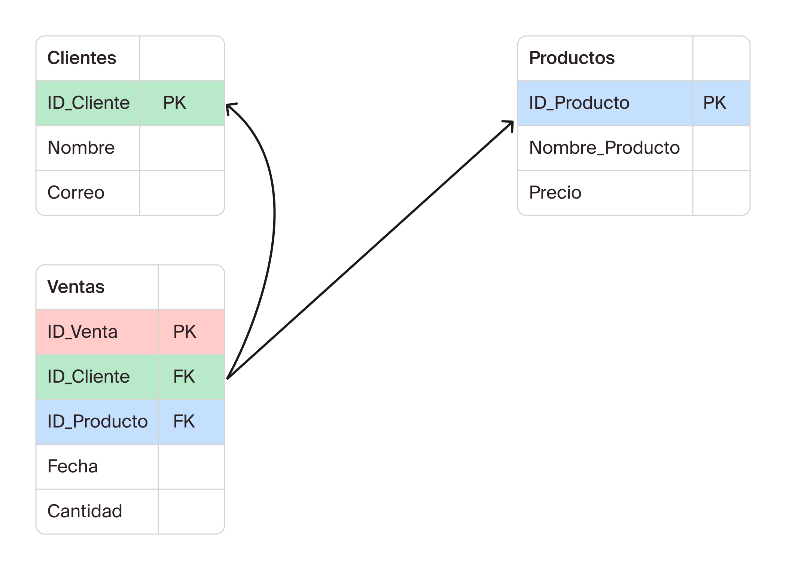

Recursos adicionales:
- [Introducción a SQL](https://www-w3schools-com.translate.goog/sql/sql_intro.asp?_x_tr_sl=auto&_x_tr_tl=es&_x_tr_hl=es&_x_tr_pto=wapp)
  

### C1 - Lección 2: Identificar claves y relaciones entre tablas
- Clave Primaria (Primary Key - PK): es un identificador único para cada fila en una tabla.
- Clave Foránea (Foreign Key - FK): es una columna en una tabla que hace referencia a la clave primaria de otra tabla.

¿Por qué importan?  
por ejemplo, si no existieran claves, cada vez que un cliente hiciera una compra, deberías guardar su nombre, apellido, correo y demás datos en cada fila de la tabla de ventas. Esto es ineficiente y propenso a errores.
  

### C1 - Lección 3: Interpretar esquemas del mundo real
Un **Diagrama de Entidad-Relación** (ERD) es como un mapa visual de la base de datos. Muestra las tablas (entidades), sus columnas y las relaciones entre ellas. Leer un ERD te permite entender cómo fluye la información dentro de una empresa.

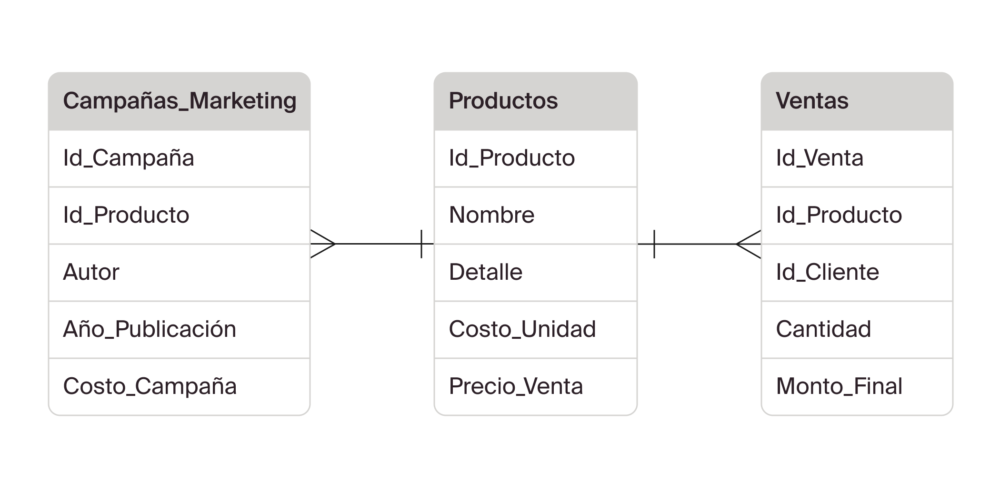
💡 El verdadero valor de este esquema es la capacidad de combinar datos de distintas tablas para responder preguntas de negocio complejas. Cada relación habilita un nuevo tipo de análisis.

Recursos adicionales
- YouTube: [Diagramas de Entidad-Relación (ERD) en Lucid Chart](https://www.youtube.com/watch?v=TKuxYHb-Hvc)
  

### C1 - Lección 4: Inspeccionar tablas con SQL

 Primer vistazo a los datos:
- `SELECT *`: el asterisco significa "muéstrame todas las columnas".
- `FROM nombre_tabla`: le indica a la base de datos de qué tabla quieres ver los datos.
- `LIMIT N`: limita la cantidad de filas que se muestran

💡 El orden importa
- Ejemplo: `SELECT * FROM fitness_trackers LIMIT 10;`
- Para seleccionar ciertas columnas:  `SELECT Titulo, Artista FROM Canciones;` 
  

Tipos de datos
- **Texto (TEXT/VARCHAR):** letras o caracteres especiales (ej. "Café Clásico", "clientes@email.com").
- **Números (INTEGER/FLOAT):** valores numéricos , pueden ser enteros (INTEGER) o números con decimales (FLOAT).
- **Fechas (DATE/TIMESTAMP):** valores que representan fechas y/o horas (ej. 01/01/2024, 2024-01-01 10:30:00).

💡 La correcta identificación del tipo de datos es crucial porque te dice qué tipo de análisis puedes realizar. No puedes sumar un texto, ni promediar una fecha.
  

Recursos adicionales:
- [SQL W3Schools:](https://www.w3schools.com/sql/trysql.asp?filename=trysql_select_columns) una herramienta gratuita y en línea para practicar tus consultas SQL sin necesidad de instalar un programa de base de datos
- [Tutoriales de SQL básico](https://www.w3schools.com/sql/sql_select.asp)
   

---
## Capitulo 2:  Consultas SQL para selección, filtrado y organización de datos
### C2 - Lección 1: Seleccionar columnas específicas
 

**🎯 Propósito de la lección**

Aprender a elegir solo las columnas relevantes de una tabla con SELECT, y a renombrarlas con `alias (AS)` para que el resultado sea claro y **“hable el idioma del negocio”**.

**🧠 Idea central**

En SQL siempre respondemos dos cosas, en este orden:

- Qué columnas mostrar → `SELECT` 

- De dónde traerlas → `FROM`

**1. Seleccionar todas las columnas (exploración)**

`SELECT *FROM fitness_trackers;`

Útil para un primer vistazo, pero no para reportes.

**Problemas de** `SELECT *``**:**

- 🔎 Legibilidad: demasiados campos no necesarios.

- 🐢 Rendimiento: más datos de los que usas = consultas más lentas.

- 🔐 Seguridad: puedes exponer información sensible.

- 💸 Costo: mover datos innecesarios encarece el procesamiento.

**2. Seleccionar columnas específicas (reporte)**

`SELECT brand_name, selling_price, rating FROM fitness_trackers;`

**Obtenemos solo lo pedido:** reporte limpio, comprensible y eficiente.

**Ventajas de limitar columnas**

- ✅ Eficiencia: menos E/S y menor tiempo de ejecución.

- ✅ Claridad: resultados sin “ruido”.

- ✅ Seguridad: reduces exposición de datos.

- ✅ Costo: menos transferencia y cómputo.

3. Hacer que el resultado “hable negocio” con alias (AS)

Los alias renombran las columnas en el resultado sin tocar la tabla.

`SELECT`
  `Brand_Name   AS marca,`
  `Selling_Price AS precio,`
  `Rating        AS calificacion`
`FROM fitness_trackers;`

**Cuándo usar alias**

- Para traducir nombres técnicos o en inglés.

- Para simplificar encabezados largos.

- Para desambiguar columnas con el mismo nombre (especialmente en JOIN).

**🔎 Nota:** El alias no cambia el esquema de la tabla; **solo el encabezado** mostrado por esa consulta.

**Practica guiada**

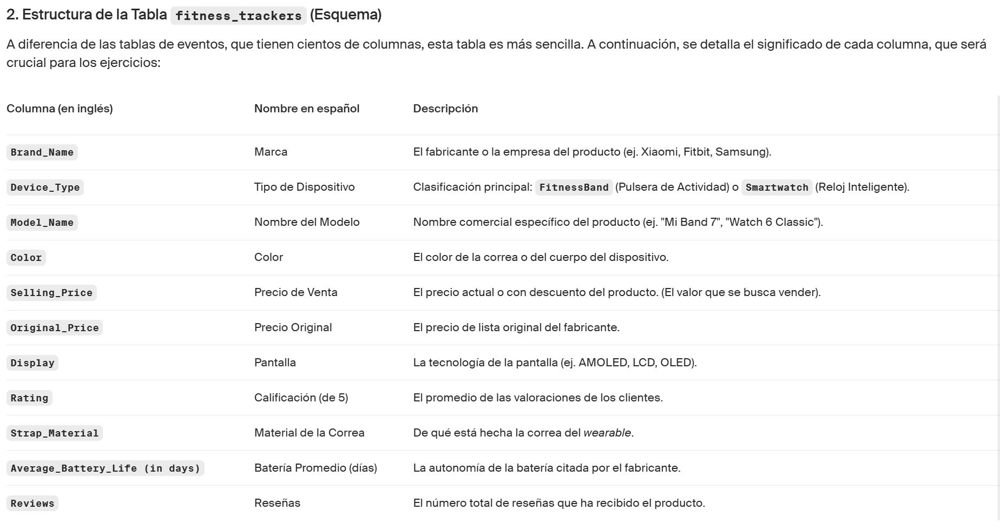

1. **Contexto:** El equipo quiere preparar un cuadro rápido con solo la marca (brand) y el precio de venta (selling price) de los productos.

**Tu objetivo:** Seleccionar las columnas Brand_Name y Selling_Price de la tabla fitness_trackers.
Usar alias Brand y Price_USD.

**Respuesta:**

`SELECT Brand_Name AS Brand,`
       `Selling_Price AS Price_USD`
`FROM fitness_trackers;`

2. **Contexto:** El equipo quiere ampliar el análisis anterior. Quieren ver una comparativa entre el precio de venta y el precio original, además de la marca. 

**Tu objetivo:** Seleccionar las columnas brand_name, original_price y selling_price de la tabla fitness_trackers.No uses alias.

**Respuesta:**

`SELECT Brand_Name,` `original_price,` `Selling_Price`
`FROM fitness_trackers;`

3. **Contexto:** El equipo de Calidad quiere un reporte el nombre de las marcas y el rating. Quieren revisar la reputación de cada una de las marcas que existen en la base de datos. 

**Tu objetivo:** Seleccionar esas dos columnas (Brand_Name, Rating) de la tabla fitness_trackers.
Usar alias claros: Marca, Puntaje.

**Respuesta:**

`SELECT Brand_Name AS Marca,`
       `Rating as Puntaje`
`FROM fitness_trackers;`

4. **Contexto:** El equipo de producto quiere un reporte con el modelo, el color y precio original.

**Tu objetivo:** Seleccionar esas tres columnas (Model_Name, Color, Original_Price) de la tabla fitness_trackers.
Usar alias claros: Modelo, Precio_Original.

**Respuesta:**

`SELECT Model_Name AS Modelo,`
       `Color,`
       `Original_Price AS Precio_Original`
`FROM fitness_trackers;`

 

### C2 - Lección 2: Filtrar datos con clausulas WHERE
 

**🎯 Propósito de la lección**

Pasar de **“verlo todo”** a **ver solo lo que importa**. se usa WHERE para:

- Enfocar el análisis en criterios específicos.

- Aplicar comparaciones `(=, >, <, >=, <=, <>/!=)`.

- Filtrar por rangos `(BETWEEN)`.

- Filtrar contra listas `(IN / NOT IN)`.

- Combinar condiciones `(AND / OR)` y entender su precedencia.

- Cuidar detalles con texto/fechas (comillas) y el impacto en agregaciones.

**🧠 Idea central**

Toda consulta responde dos cosas:

1. qué columnas mostrar `(SELECT …)` y de dónde traerlas `(FROM …)`.
2. Con `WHERE` decidimos qué filas cumplen nuestras condiciones.

**¿Qué pasa si no filtramos?**

`SELECT Brand_Name, Selling_Price, Rating`
`FROM fitness_trackers;`

Obtenemos todas las filas (p. ej. 610 dispositivos). El reporte queda ruidoso, mezcla productos baratos con mala calificación y carísimos sin contexto.

**Conclusión: en analítica, mostrar todo es mostrar nada útil. Aquí entra WHERE.**

**🧩 Sintaxis base**

`SELECT columnas`
`FROM   tabla`
`WHERE  condicion;`

- Primero SELECT, luego FROM, después WHERE.

- Las fechas y textos van entre comillas (p. ej., 'FitBit', '2024-01-01').

**1. Igualdades (=) con texto y fechas**

`SELECT Brand_Name, Selling_Price, Rating`
`FROM fitness_trackers`
`WHERE Brand_Name = 'FitBit';`

- Funciona para números, texto y fechas.

- Para texto/fecha: usa comillas simples.

**Pro tip:** algunos motores son case-insensitive por defecto, pero no todos. Si se necesita control, normalizar `(UPPER(Brand_Name) = 'FITBIT')`.

**2. Comparaciones (> , < , >= , <=)**

_“Muestra solo los mejor calificados”_

`SELECT Brand_Name, Selling_Price, Rating`
`FROM fitness_trackers`
`WHERE Rating > 4.7;`

Aplica a números y fechas `(created_at >= '2024-01-01')`.

**3. Rangos con BETWEEN**

`BETWEEN a AND b` es inclusivo (incluye límites `a` y `b`).

`SELECT Brand_Name, Selling_Price, Rating`
`FROM fitness_trackers`
`WHERE Selling_Price BETWEEN 28000 AND 29000;`

Equivalente a `Selling_Price >= 28000 AND Selling_Price <= 29000`.

**4. Listas de valores con IN / NOT IN**

`SELECT Brand_Name, Selling_Price, Rating`
`FROM fitness_trackers`
`WHERE Brand_Name IN ('FitBit', 'Xiaomi');`

- Útil cuando se filtra por conjuntos finitos (marcas, categorías, países).
- `NOT IN` excluye la lista.

**Pro tip:** si hay `NULL` en la columna, `NOT IN` puede comportarse distinto según motor. Prefiere `WHERE Brand_Name IS NULL OR Brand_Name NOT IN (…)` si necesitan incluir nulos explícitamente.

**5. Combinar condiciones: AND / OR (y paréntesis)**

**Caso:** “Modelos FitBit con precio entre 17.000 y 20.000”.

`SELECT brand_name, model_name, display, strap_material, selling_price`
`FROM fitness_trackers`
`WHERE brand_name = 'FitBit'`
  `AND selling_price BETWEEN 17000 AND 20000;`

**¿Y si el pedido fuera “FitBit o productos en ese rango de precio”?**

`SELECT brand_name, selling_price`
`FROM fitness_trackers`
`WHERE brand_name = 'FitBit'`
   `OR selling_price BETWEEN 17000 AND 20000;`

**Regla práctica**

- `AND` → todas las condiciones deben cumplirse.
- `OR` → basta con una.
- Siempre usar paréntesis para dejar claro el orden:

`WHERE (brand_name = 'FitBit' AND rating > 4.5)`
   `OR (brand_name IN ('Xiaomi','Garmin') AND selling_price < 20000)`

**Impacto en agregaciones**

Los filtros cambian los resultados de métricas (promedios, sumas, conteos).
Ejemplo: promedio de precio para marcas específicas:

`SELECT AVG(selling_price) AS avg_price`
`FROM fitness_trackers`
`WHERE brand_name IN ('FitBit','Xiaomi') AND rating > 4.5;`

**Errores comunes (y cómo evitarlos)**

- ❌ Mezclar `AND` y `OR` sin paréntesis → ✅ Agrupar con `()`.

- ❌ Olvidar comillas en texto/fecha → ✅ `'texto'`, `'YYYY-MM-DD'`.

- ❌ Confiar en `NOT IN` con posibles NULL → ✅ usar `IS NULL` explícito si aplica.

- ❌ Asumir que `BETWEEN` es exclusivo → ✅ es inclusivo.

- ❌ Filtrar después de agregar → ✅ recordar el orden:
    `SELECT … FROM … WHERE … GROUP BY … HAVING … ORDER BY … LIMIT.`

**Tarea práctica**

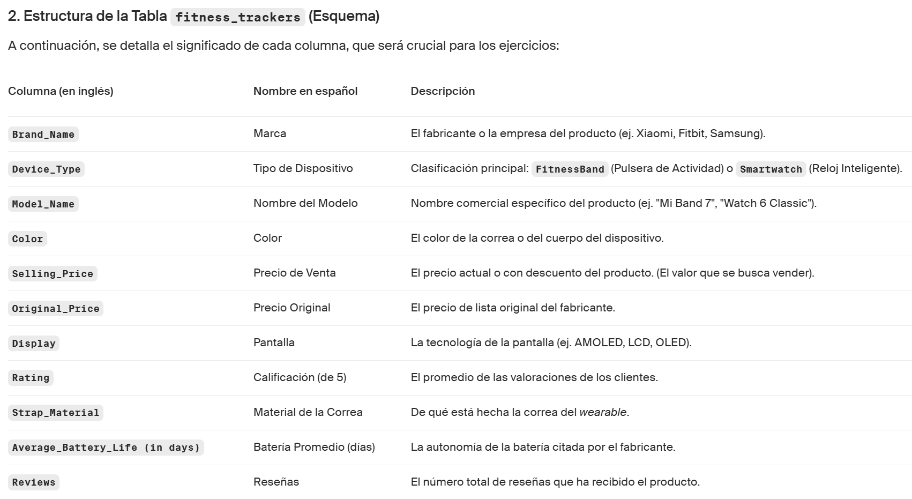

1. **Contexto:** El equipo de R&D quiere analizar únicamente los productos de la marca Fitbit o los que tengan rating entre 4 y 5.

**Tu objetivo:** 
- Seleccionar brand_name, model_name, rating.
- Filtrar por una de estas dos condiciones (debe cumplirse al menos una de las siguientes): 
    1. brand_name = 'FitBit'. 
    2. rating entre 4 y 5.

**Respuesta:**

`SELECT brand_name, model_name, rating`
`FROM fitness_trackers`
`WHERE brand_name = 'FitBit'`
`OR rating between 4 and 5`

2. **Contexto:** El equipo de producto quiere enfocarse en Fitbit, Garmin y Noise, pero solo en aquellos dispositivos con precio de venta mayor a 3000 y precio original menor a 10000.

**Tu objetivo:**

- Seleccionar model_name, brand_name, selling_rice y original_price.
- Filtrar por las marcas Fitbit, Garmin y Noise (brand_name) utilizando (IN).
- Filtrar por selling_price > 3000.
- Filtrar por original_price < 10000.

**Respuesta:**

`SELECT model_name, brand_name, selling_price, original_price`
`FROM fitness_trackers`
`WHERE brand_name IN ('FitBit', 'Garmin', 'Xiaomi')`
  `AND selling_price > 3000`
  `AND original_price < 10000;`

 

### C2 - Lección 3: Ordenar resultados con ORDER BY
 

**🎯 Propósito de la lección**

Aprender a usar ORDER BY para:

- Ordenar resultados en ascendente (ASC) o descendente (DESC).

- Crear rankings útiles (más caros, mejor calificados, etc.).

- Combinar ORDER BY con WHERE y LIMIT para informes claros y accionables.

- Ordenar por más de una columna (orden compuesto).

**🧠 Idea central**

`ORDER BY` define cómo mostrar las filas: primero decide qué traer `(SELECT ... FROM ... WHERE ...)` y luego cómo ordenarlas `(ORDER BY ...)`. Si además se quiere un Top N, aplicar LIMIT al final.

1. **Ordenar productos por precio (descendente)**

**Pedido:** _“Lista de productos Fitbit del más caro al más barato”._

`SELECT Brand_Name, Model_Name, Selling_Price, Rating`
`FROM fitness_trackers`
`WHERE Brand_Name = 'Fitbit'`
`ORDER BY Selling_Price DESC;`

**Claves:**

`ORDER BY Selling_Price` → define el criterio de orden.

`DESC` → orden descendente (más caros primero).

Si se omite `ASC/DESC`, el orden por defecto es ascendente `(ASC)`.

2. **Ordenar por más de una columna (orden compuesto)**

**Pedido:** _“Comparar Fitbit vs Xiaomi y ver los más caros dentro de cada marca”._

`SELECT Brand_Name, Model_Name, Selling_Price, Rating`
`FROM fitness_trackers`
`WHERE Brand_Name IN ('Fitbit', 'Xiaomi')`
`ORDER BY Brand_Name ASC, Selling_Price DESC;`

**¿Cómo leerlo?:**

- Primero agrupa por marca (A→Z).
- Dentro de cada marca, ordena por precio de mayor a menor.
- Este patrón resuelve empates (si dos filas empatan en la primera clave, usa la segunda).

**Pro tip:** añade una tercera clave si necesita orden estable (p. ej., Model_Name ASC).

3. **Ordenar y limitar la cantidad de resultados (Top N)**

**Pedido:** _“Top 5 precios más altos de Fitbit”._

`SELECT Brand_Name, Model_Name, Selling_Price, Rating`
`FROM fitness_trackers`
`WHERE Brand_Name = 'Fitbit'`
`ORDER BY Selling_Price DESC`
`LIMIT 5;`

**Notas prácticas:**

- `LIMIT` se aplica después de ordenar. Primero se ordena, luego se recorta el resultado.

- Según el motor SQL:

    - PostgreSQL/MySQL/SQLite → `LIMIT N`
    - SQL Server → `SELECT TOP (N)` ... (o `FETCH FIRST N ROWS ONLY` con `OFFSET/FETCH`)
    - Oracle → `FETCH FIRST N ROWS ONLY`

**Errores comunes (y cómo evitarlos)**

- ❌ Poner `ORDER BY` antes de `WHERE`. ✅ Orden correcto: `SELECT … FROM … WHERE … ORDER BY … LIMIT.`
- ❌ Esperar que `LIMIT` funcione igual en todos los motores. ✅ Revisar la sintaxis del motor (nota de compatibilidad arriba).
- ❌ Resultados “raros” por nulos. ✅ Revisar si hay `NULL` y usar `NULLS FIRST/LAST` si el motor lo soporta, o filtrar con `WHERE Rating IS NOT NULL`.
- ❌ Empates no deseados. ✅ Añadir claves secundarias: `ORDER BY Selling_Price DESC, Rating DESC, Model_Name ASC.`

**Actividad práctica**

1. **Contexto:** El equipo de R&D quiere ver los smartwatch de marca Apple con mejor rating y que sean de color negro. 

**Tu objetivo:**

- Seleccionar device_type, brand_name, color, Rating.
- Filtrar por device_Type = 'Smartwatch', brand_name = 'APPLE' y color = 'Black'. En este punto respeta - las mayúsculas y minúsculas.
- Ordenar de mayor a menor por Rating.
- Limita los resultados a 3 (queremos ver el top 3).

**Respuesta:**

`SELECT device_type, brand_name, color, Rating`
`FROM fitness_trackers`
`WHERE Device_Type = 'Smartwatch'`
`AND brand_name = 'APPLE'`
`AND COLOR = 'Black'`
`ORDER BY Rating DESC`
`LIMIT 3;`

2. **Contexto:** El equipo de finanzas quiere identificar los 5 productos con menores rating.

**Tu objetivo:**

- Seleccionar brand_name, Model_Name y rating.
- Renombrar con un alias la columna brand_name. Llamarla Marca.
- Renombrar con un alias la columna Model_Name. Llamarla Modelo.
- Ordenar de menor a mayor por rating.
- Limitar a las 5 primeras filas.

**Respuesta:**

`SELECT brand_name as Marca,`
       `model_name as Modelo,`
       `Rating`
`FROM fitness_trackers`
`ORDER BY Rating ASC`
`LIMIT 5;`

 

### C2 - Lección 4: Agrupar y agregar datos
 

**🎯 Propósito de la lección**

Aprender a transformar tablas de registros en resúmenes ejecutivos usando:

- `GROUP BY` para agrupar filas por categorías (marca, modelo, etc.).

- Funciones de agregación: `COUNT`, `SUM`, `AVG`, `MIN`, `MAX`.

- Interpretación de resultados agrupados y su uso para responder preguntas de negocio.

**🧠 Idea central**

Los equipos no analizan filas sueltas: necesitan resúmenes.
Con `GROUP BY` defines por qué campo resumir; con las funciones de agregación defines qué cálculo aplicar a cada grupo.

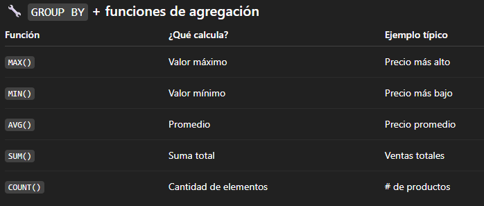

Cada columna seleccionada que no esté dentro de una función de agregación, debe aparecer en el `GROUP BY`.

1. **Ejemplo  — Máximo precio por modelo (solo Xiaomi)** 

“Una fila por modelo mostrando su precio de venta máximo (marca: Xiaomi).”

`SELECT`
  `model_name AS modelo,`
  `MAX(selling_price) AS precio_venta_max`
`FROM fitness_trackers`
`WHERE brand_name = 'Xiaomi'`
`GROUP BY model_name;`

**Lectura:** agrupas por `model_name` y, para cada grupo, reportas el mayor `selling_price`.

2. **Ejemplo — Promedio por marca**

_“¿Cuál es el precio promedio por marca?”_

`SELECT`
  `brand_name,`
  `ROUND(AVG(selling_price), 2) AS avg_price`
`FROM fitness_trackers`
`GROUP BY brand_name`
`ORDER BY brand_name ASC;`

Notas:

- `ROUND` mejora la presentación (2 decimales).

- `ORDER BY` ordena el resultado final (alfabético por marca).

3. **Ejemplo — Conteo de reseñas perfectas (rating = 5) por marca**

`SELECT`
  `brand_name,`
  `COUNT(rating) AS cnt_rating_5`
`FROM fitness_trackers`
`WHERE rating = 5`
`GROUP BY brand_name`
`ORDER BY cnt_rating_5 DESC;`

**🧱 Orden correcto de cláusulas (pipeline mental)**

`SELECT → FROM → WHERE → GROUP BY → HAVING → ORDER BY → LIMIT`

- `WHERE` filtra filas antes de agrupar.

- `HAVING` filtra grupos después de agrupar.

- `ORDER BY` ordena el resultado agregado.

- `LIMIT` recorta el top final.

**WHERE vs HAVING (cuándo usar cada uno)**

**Filtra filas (previas al agregado):**

-- Solo modelos lanzados desde 2024; luego se agrupa 
 

`WHERE launch_date >= '2024-01-01'`

**Filtra grupos (resultado del agregado):**

-- Marcas cuyo precio promedio supera 20,000
 

`SELECT brand_name, AVG(selling_price) AS avg_price`
`FROM fitness_trackers`
`GROUP BY brand_name`
`HAVING AVG(selling_price) > 20000`
`ORDER BY avg_price DESC;`

**Regla:** Si el filtro se refiere a una agregación `(AVG(...)`, `COUNT(...)`, etc.), usar `HAVING`.

**Errores comunes (y cómo evitarlos)**

- ❌ Seleccionar columnas no agregadas que no están en el `GROUP BY`. ✅ Inclúyelas en `GROUP BY` o envolverlas en una función de agregación.

- ❌ Usar `WHERE` para filtrar por un promedio/total. ✅ Usar `HAVING` para filtrar después del `GROUP BY`.

- ❌ Confundir `COUNT(col)` con `COUNT(*)`. ✅ `COUNT(col)` ignorar NULL; `COUNT(*)` cuenta todas las filas.

- ❌ Resultados con demasiados decimales. ✅ Usar `ROUND(AVG(...), 2)` o `CAST(... AS NUMERIC(12,2))`.

- ❌ Olvidar el orden de cláusulas. ✅ Repetir el pipeline: `SELECT → FROM → WHERE → GROUP BY → HAVING → ORDER BY → LIMIT`.

**Práctica guiada**

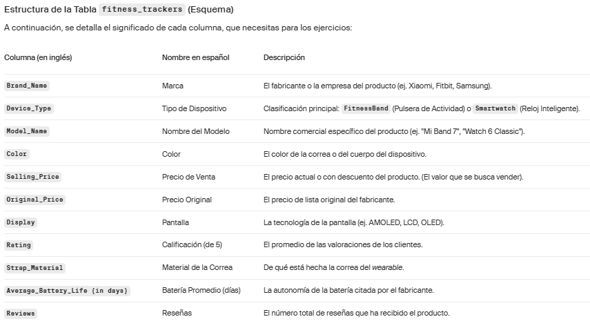

1. **Contexto:** El equipo de R&D quiere saber cuántos productos ofrece cada marca en el dataset.

**Tu objetivo:**

- Seleccionar Brand_Name y COUNT(Model_Name).
- Agrupar por marca.
- Indica los alias marca y total_productos para cada una de las columnas.

**Respuesta:**

`SELECT Brand_Name as marca,` 
       `count(Model_Name) as total_productos`
`FROM fitness_trackers`
`GROUP BY Brand_Name`

2. **Contexto:** El equipo de estrategia quiere una lista de los productos con rating mayor a 4.8. De estos productos quieren el precio promedio de venta y el precio promedio original. 

**Tu objetivo:**

- Seleccionar brand_name, model_name , avg(original_price) y avg(selling_price).
- Agrupar por brand_name y por model_name.
- Ordenar por brand_name.

**Respuesta:**

`SELECT brand_name,`
        `model_name,`
        `avg(original_price),`
        `avg(selling_price)`
`FROM fitness_trackers`
`WHERE rating > 4.8`
`GROUP BY brand_name,model_name`
`ORDER BY brand_name`

 

### C2 - Lección 5: Limpiar y preparar datos
 

**🎯 Propósito de la lección**

- Aprender a detectar, tratar y estandarizar datos antes del análisis:

- Identificar y manejar valores faltantes (NULL) con IS NULL, IS NOT NULL y COALESCE.

- Excluir filas irrelevantes/incompletas con WHERE.

- Quitar duplicados con DISTINCT (y alternativas).

- Conocer transformaciones básicas de tipos y textos para dejar la tabla lista para KPIs.

**🧠 Idea central**

Un dashboard sólo es tan bueno como sus datos.
En SQL, limpiar = **detectar** (qué falta o sobra), **decidir** (qué hacer) y **aplicar** (con funciones y filtros).

1. **Detectando y manejando NULL**

- En SQL, los faltantes son `NULL`.

- `AVG(col)` ignora `NULL`; el resultado puede ocultar que faltan datos.

    A. **Ver filas con `rating` nulo**

    `SELECT *`
    `FROM fitness_trackers`
    `WHERE rating IS NULL;`

    B. **Ver filas con `rating` no nulo**

    `SELECT *`
    `FROM fitness_trackers`
    `WHERE rating IS NOT NULL;`

    C. **Reemplazar nulos con un valor (con coalesce)**

    `SELECT`
    `model_name,`
    `COALESCE(rating, 0) AS clean_rating`
    `FROM fitness_trackers;`

    Úsarlo sólo si el 0 representa un valor de negocio válido. Para rating, normalmente no lo es.

    D. **Recalcular promedios evidenciando el impacto**

    -- Promedio “natural” (ignora NULL)
     
    `SELECT AVG(rating) AS avg_rating_no_nulls`
    `FROM fitness_trackers;`

    -- Promedio imputando 0 (suele sesgar hacia abajo)
     
    `SELECT AVG(COALESCE(rating, 0)) AS avg_rating_with_zeros`
    `FROM fitness_trackers;`

**💡 Criterio de negocio ante nulos en rating:**

- **Reporte de satisfacción:** filtra a `WHERE rating IS NOT NULL`.
- **Exposición de productos:** separa “con rating” vs “sin rating” con conteos (`COUNT(rating)` vs `COUNT(*)`).
- **Imputación robusta:** si se debe imputar, considerar median/mode o un valor por categoría (p. ej., por marca) usando subconsultas.

2. **Eliminando filas irrelevantes o incompletas**

**Caso:** Marketing necesita un listado de marcas y modelos actuales con precio válido.

    A. **Quitar filas sin precio**

    `SELECT *`
    `FROM fitness_trackers`
    `WHERE selling_price IS NOT NULL;`

    B. **Listado único Marca–Modelo**

    `SELECT DISTINCT brand_name, model_name`
    `FROM fitness_trackers`
    `WHERE selling_price IS NOT NULL;`

    `DISTINCT` retorna combinaciones únicas de las columnas listadas.

3. **Otras transformaciones útiles de limpieza**

    A. **Estandarizar textos**

    `SELECT`
    `TRIM(brand_name)  AS brand_name_clean,`
    `UPPER(color)      AS color_upper`
    `FROM fitness_trackers;`

    B. **Asegurar tipos**

    `SELECT`
    `CAST(selling_price AS NUMERIC(12,2)) AS selling_price_num`
    `FROM fitness_trackers;`

    C. Fechas

    -- Según motor, CONVERT/TO_DATE/CAST
    `SELECT`
    `CAST(release_date AS DATE) AS release_dt`
    `FROM fitness_trackers;`

**Pipeline recomendado**

`SELECT → FROM → WHERE → GROUP BY → HAVING → ORDER BY → LIMIT`

- Limpiar primero con WHERE/COALESCE/casts/normalizaciones.

- Luego agrega (GROUP BY) y presenta (ORDER BY, LIMIT).

**Errores comunes (y cómo evitarlos)**

- ❌ Suponer que `AVG` promedia “ceros” ocultos. ✅ `AVG` ignora `NULL`; comprueba el porcentaje de nulos.
- ❌ Imputar `rating` con `0`. ✅ Prefiere filtrar o imputar con mediana/segmento si es obligatorio.
- ❌ Creer que `DISTINCT` “elimina duplicados” en toda la fila. ✅ Sólo hace únicas las columnas listadas; usar `ROW_NUMBER()` para deduplicar de verdad.
- ❌ No convertir tipos antes de cálculos. ✅ Usar `CAST/CONVERT`; valida rangos y formatos.
- ❌ Mezclar limpieza y análisis sin claridad. ✅ Usar `CTE` o vistas para dejar un dataset `“clean_...”` y reutilizar.

**Práctica guiada**

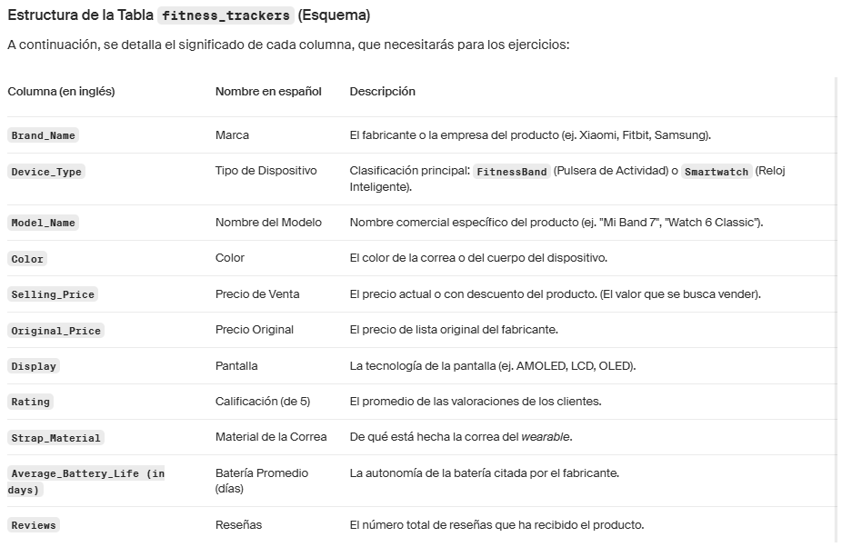

1. **Contexto:** Tu jefe te pide controlar la tabla `fitness_trackers` antes de calcular promedios. Algunos registros no tienen valores.

**Tu objetivo:** 
- Seleccionar `Brand_Name`, `model_name`, `selling_price`, `rating` y `reviews`.
- Reemplazar valores nulos de `selling_price`, `rating` y `reviews` con 0 usando `COALESCE`.

**Respuesta:**

`SELECT brand_name,` 
        `model_name,` 
        `COALESCE(selling_price,0),`
        `COALESCE(rating,0),` 
        `COALESCE(reviews,0)`
`FROM fitness_trackers`

2. **Contexto:** En base al ejercicio anterior, tu jefe ha analizado los resultados y quiere actualizarlo. Solamente quiere las columnas `brand_name`, `model_name` y `selling_price`. Para esta última, los valores nulos deben reemplazarse por -1. Los valores de rating nulos no deben mostrarse, tampoco las reviews nulas. 

**Tu objetivo:**

- Seleccionar `brand_name`, `model_name` y `selling_price`.
- Reemplazar valores nulos de `selling_price` con -1 usando `COALESCE`.
- Filtra con `NOT NULL` para `rating` y `reviews`.

**Respuesta:**

`SELECT brand_name,`
        `model_name,` 
        `COALESCE(selling_price,-1)`
`FROM fitness_trackers`
`WHERE rating is not null`
`AND reviews is not null`

3. **Contexto:** Marketing necesita analizar aquellas marcas que tienen rating nulos.

**Tu objetivo:**

- Seleccionar `brand_name`.
- Elimina duplicados.
- Filtra por valores de `rating` nulos.

**Respuesta:**

`SELECT distinct brand_name`
`FROM fitness_trackers`
`WHERE rating IS NULL`

4. **Contexto:** Marketing necesita ampliar el análisis revisando aquellas marcas que no tienen reviews nulas.

**Tu objetivo:**

- Seleccionar `brand_name`.
- Elimina duplicados utilizando `DISTINCT`.
- Filtra por valores de `reviews` no nulos.
- Ordena por `brand_name` de manera ascendente.

**Respuesta:**

`SELECT distinct brand_name`
`FROM fitness_trackers`
`WHERE reviews IS NOT NULL`
`ORDER BY brand_name ASC`

 

### C2 - Lección 6: Asegurar la precisión con tipos de datos y funciones
 

**🎯 Propósito de la lección**

- Asegurar precisión y consistencia antes de publicar KPIs: elegir tipos correctos y formatos adecuados.

- Diferenciar `ROUND` (presentación) vs `CAST` (tipo de dato) y cuándo usar `DECIMAL(p,s)` para métricas financieras.

- Normalizar catálogos/textos con `DISTINCT`, `UPPER`, `TRIM` y validar con `LENGTH/LEN`.

- Prevenir errores comunes: truncamientos por CAST … AS INT, collation en ordenamientos y uso indebido de FLOAT.

- Dejar una vista limpia para BI que sea legible y reutilizable.

**🧠 Idea central**

La precisión se logra en dos capas: (1) tipo correcto para calcular (p. ej., `DECIMAL`), y (2) formato correcto para comunicar (p. ej., `ROUND`). `CAST` cambia el tipo; `ROUND` solo cambia cómo se ve. Limpia y normaliza antes de reportar.

1. **Impacto de la precisión en el análisis**

Un promedio como `2333.3333333333` es correcto pero poco comunicable. Usar `ROUND` lo vuelve claro para reportes; usar `CAST` define el tipo que tendrá ese dato aguas abajo (BI, cálculos posteriores).

2. **ROUND: redondear decimales**

Caso: precio promedio por producto, a 0 y a 1 decimal.

`SELECT`
  `model_name,`
  `ROUND(AVG(selling_price), 0) AS avg_price_0,`
  `ROUND(AVG(selling_price), 1) AS avg_price_1`
`FROM fitness_trackers`
`GROUP BY model_name;`

**Claves**

- `ROUND(x, 0)` → entero redondeado.
- Úsalo para presentación; conserva los valores originales para cálculos finos.

3. **CAST: convertir tipos de datos**

**Caso:** marketing quiere entero sin decimales (truncado si tu motor así lo hace).

`SELECT`
  `CAST(AVG(selling_price) AS INT) AS avg_price_int`
`FROM fitness_trackers;`

**¿Cuándo CAST y no ROUND?**

- `ROUND` controla cómo se muestra el número.
- `CAST` cambia el tipo (decimal → entero; texto → número; etc.).
- Para números financieros, prefiere fijar tipo a `DECIMAL` en vez de convertir a `INT`.

**Recomendado (finanzas):**

`SELECT`
  `CAST(AVG(selling_price) AS DECIMAL(12,2)) AS avg_price_2d`
`FROM fitness_trackers;`

**🔎 Motores:**

- PostgreSQL: `CAST(... AS INTEGER)` trunca; `DECIMAL(p,s)` redondea al ajustar escala.
- SQL Server: `CAST(... AS INT)` trunca; `DECIMAL(p,s)` redondea.
- MySQL: `CAST(... AS SIGNED)` trunca; `DECIMAL(p,s)` redondea.

4. **DISTINCT + UPPER: listar valores únicos y normalizar**

**Caso:** listado de marcas en mayúscula, sin duplicados.

`SELECT DISTINCT UPPER(brand_name) AS brand`
`FROM fitness_trackers`
`ORDER BY UPPER(brand);`

5. **TRIM + LENGTH/LEN: espacios y validación de texto**

**Caso:** detectar espacios invisibles y limpiar.

-- PostgreSQL/MySQL
 
`SELECT DISTINCT`
  `brand_name,`
  `TRIM(brand_name)                 AS brand_trim,`
  `LENGTH(brand_name)               AS len_raw,`
  `LENGTH(TRIM(brand_name))         AS len_trim`
`FROM fitness_trackers;`

-- SQL Server (equivalentes)
 
`SELECT DISTINCT`
  `brand_name,`
  `LTRIM(RTRIM(brand_name))         AS brand_trim,`
  `LEN(brand_name)                  AS len_raw,`
  `LEN(LTRIM(RTRIM(brand_name)))    AS len_trim`
`FROM fitness_trackers;`

6. **Elección de tipos para precisión**

- Precios, tasas, montos → `DECIMAL(p,s)` (p.ej., `DECIMAL(12,2)`).
- Contadores → `INT/BIGINT`.
- Mediciones científicas → `FLOAT/DOUBLE` (si aceptas error por punto flotante).
- Fechas → `DATE/TIMESTAMP`.
- Códigos/IDs con ceros a la izquierda → texto, no entero.

**Errores comunes**

- ❌ Usar INT para precios. ✅ Usa DECIMAL(p,s).
- ❌ Suponer que CAST … AS INT = ROUND(...,0). ✅ CAST INT trunca; ROUND redondea.
- ❌ Ordenar por alias sin exponer la misma expresión. ✅ ORDER BY UPPER(brand) (o por posición si tu motor lo permite y es legible).
- ❌ Mezclar funciones que cambian tipo (CAST) con las que cambian presentación (ROUND). ✅ Decide: persistencia del tipo vs formato del reporte.
- ❌ Ignorar collation en listas alfabéticas con acentos/ñ. ✅ Define collation/locale de ordenamiento.

**Práctica guiada**

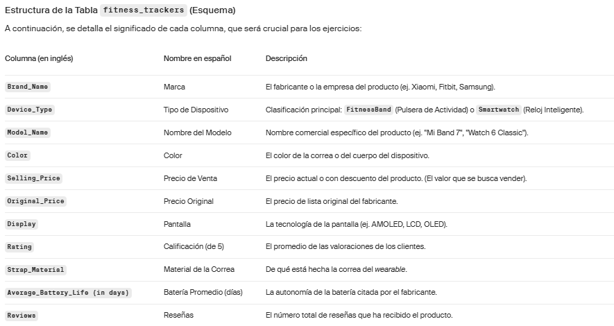

1. **Contexto:** Estrategia quiere saber el precio promedio de la marca FitBit, redondeado a 0 decimales (usando `ROUND`).

**Instrucciones:**

- Calcular el precio promedio (columna selling_price).
- Redondear el resultado a 0 decimales.
- Usa el alias avg_price.
- Filtra por el la marca FitBit

**Respuesta:**

`SELECT` 
`ROUND(avg(selling_price),0) as avg_price`
`FROM fitness_trackers`
`WHERE brand_name = 'FitBit'`

2. **Contexto:** Marketing quiere analizar el mercado, viendo cuántos productos distintos existen por marca para precios de venta mayores a 25000.

**Tu objetivo:**

- Agrupar los productos por marca (columna brand_name).
- Usar COUNT(DISTINCT + columna) para contar productos únicos por marca.
- Ordenar los resultados de mayor a menor cantidad.
- Muestra solo las primeras 5 marcas.
- Filtrar por precio mayor a 25000 (columna selling_price).

**Respuesta:**

`SELECT brand_name,`
        `COUNT(distinct model_name)`
`FROM fitness_trackers`
`WHERE selling_price > 25000`
`GROUP BY brand_name`
`ORDER BY  count(distinct model_name) DESC`
`LIMIT 5`

  

---
## Capitulo 3: Cálculo de métricas financieras clave
### C3 - Lección 1: Unir tablas para análisis integrados
 

**🎯 Propósito de la lección**

- Integrar datos de múltiples tablas con `JOINs` para análisis financieros y de negocio.
- Elegir correctamente entre `INNER JOIN` (coincidencias) y `LEFT JOIN` (conservar todo lo de la tabla base).
- Manejar valores nulos `(NULL)` que aparecen al unir tablas, sin sesgar métricas.
- Unir ingresos, costos y campañas en un solo dataset listo para KPIs.

**🧠 Idea central**

Un buen análisis integrado depende de cómo unes. Decide la estrategia de `JOIN` según el objetivo (completitud vs exactitud de match) y controla los `NULL` con reglas explícitas para que sumas, promedios y márgenes no se rompan.

**Resumen ejecutivo**

- `INNER JOIN:` solo filas con match en ambas tablas. Útil para “datos completos” (p.ej., viajes con costo cargado).
- `LEFT JOIN:` conserva todas las filas de la tabla izquierda; la derecha aporta datos cuando hay match; si no, quedan `NULL`. Ideal para no perder ingresos aún sin costos cargados.
- `NULL` al unir: decide si tratarlo como 0 (con COALESCE) o excluirlo (IS NOT NULL) según la métrica/uso.
- **Regla de oro del `LEFT`:** filtros de la tabla derecha en ON si no quieres convertirlo involuntariamente en `INNER`.

**INNER JOIN vs LEFT JOIN**

- ¿Quieres completitud (solo casos con toda la info)? → `INNER JOIN`.
- ¿Quieres conservar la base (p. ej., todos los ingresos aunque falte costo)? → `LEFT JOIN`.
- ¿Métrica a calcular se rompe con nulos? → `COALESCE()` o filtra con `IS NOT NULL` según el caso.

**Caso Uber — consultas base**

`INNER JOIN` (solo viajes con ingreso y costo):

`SELECT`
  `uvb.booking_id,`
  `uvb.valor_booking,`
  `ucv.costo_total`
`FROM uber_viajes_bookings AS uvb`
`INNER JOIN uber_costo_viajes AS ucv`
  `ON uvb.booking_id = ucv.booking_id;`

`LEFT JOIN` (conservar todos los ingresos):

`SELECT`
  `uvb.booking_id,`
  `uvb.valor_booking,`
  `ucv.costo_total`
`FROM uber_viajes_bookings AS uvb`
`LEFT JOIN uber_costo_viajes AS ucv`
  `ON uvb.booking_id = ucv.booking_id;`
-- Si no hay costo, ucv.costo_total será NULL

**Manejo de valores nulos (NULL) tras el LEFT**

**Opción A — Tratar NULL como 0 (reporting sin “hoyos”):**

`SELECT`
  `uvb.booking_id,`
  `uvb.valor_booking,`
  `COALESCE(ucv.costo_total, 0) AS costo_total`
`FROM uber_viajes_bookings AS uvb`
`LEFT JOIN uber_costo_viajes AS ucv`
  `ON uvb.booking_id = ucv.booking_id;`

**Opción B — Excluir filas sin costo (análisis que exige completitud):**

`SELECT`
  `uvb.booking_id,`
  `uvb.valor_booking,`
  `ucv.costo_total`
`FROM uber_viajes_bookings AS uvb`
`LEFT JOIN uber_costo_viajes AS ucv`
  `ON uvb.booking_id = ucv.booking_id`
`WHERE ucv.costo_total IS NOT NULL;`  -- esto hace que el resultado sea equivalente a un INNER

**🔎 Cuidado:** ese `WHERE` ucv.costo_total `IS NOT NULL` “mata” el efecto del `LEFT`. Si se necesita conservar el `LEFT` pero solo excluir costos nulos para una métrica puntual, aplicar la condición dentro de la métrica (p. ej., `SUM(COALESCE(ucv.costo_total,0)))` o usa `CTEs`.

**JOINs con campañas (dimensión opcional)**

`SELECT`
  `uvb.booking_id,`
  `uvb.valor_booking,`
  `ucm.campana_descripcion`
`FROM uber_viajes_bookings AS uvb`
`LEFT JOIN uber_campanas_mercadeo AS ucm`
  `ON uvb.campana_id = ucm.campana_id;`

**Cardinalidad y duplicados (punto fino que evita dolores)**

- Si una reserva `(booking_id)` tiene múltiples costos o múltiples campañas, el `JOIN` generará duplicados y las sumas se inflarán.

**Errores comunes**

- ❌ Filtrar tabla derecha en WHERE con LEFT JOIN → lo convierte en INNER. ✅ Pon la restricción en la métrica (COALESCE) o acepta conscientemente el INNER.
- ❌ COUNT(*) con LEFT JOIN sobrestima en presencia de duplicados. ✅ Usa COUNT(DISTINCT uvb.booking_id) según tu unidad de análisis.
- ❌ Sumar NULL da 0 silencioso pero promedios y divisiones con NULL pueden sesgar. ✅ SUM(COALESCE(col,0)), y para promedios define denominador explícito.
- ❌ Unir por columnas de texto con formatos inconsistentes. ✅ Normaliza claves (trim, case), o idealmente usa IDs numéricos/indexados.
- ❌ Rendimiento: SELECT * + sin índice en la clave de unión. ✅ Selecciona solo columnas necesarias y asegura índice en booking_id, campana_id.

**Práctica guiada**

**Tabla 1**

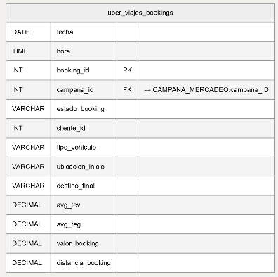

**Tabla 2**

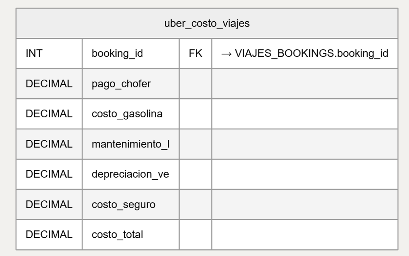

**Tabla 3**

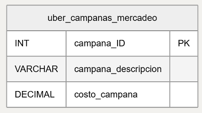

1. **Contexto:**  Finanzas necesita una vista limpia de la tabla `uber_viajes_bookings`. Algunos registros traen campos vacíos por carga incompleta (p. ej., `valor_booking` o `tipo_vehiculo`). 

**Tu objetivo:**

- Reemplazar el valor nulo en `valor_booking` por `0` → Utiliza alias `clean_revenue`.
- Si `campana_id` viene con un valor nulo, mostrar `0`.

**Respuesta:**

`SELECT`
  `booking_id,`
  `COALESCE(valor_booking, 0) AS clean_revenue,`
  `COALESCE(campana_id, 0)AS campana_id_clean`
`FROM uber_viajes_bookings;`

2. **Contexto:** Marketing quiere saber qué viajes provinieron de campañas y cuánto ingresaron.

**Tu objetivo:**

- Seleccionar `campana_descripcion`.
- Añadir la columna calculada `SUM(valor_booking)` como `total_revenue`.
- Unir `uber_viajes_bookings` con `uber_campanas_mercadeo`. Utiliza los alias `uvb` y `ucm` para cada tabla respectivamente.
- Agrupar los resultados por `campana_descripcion`.

**Respuesta:**

`SELECT ucm.campana_descripcion,`
			 `SUM(uvb.valor_booking) AS total_revenue`
`FROM uber_viajes_bookings AS uvb`
`LEFT JOIN uber_campanas_mercadeo AS ucm`
  `ON uvb.campana_id = ucm.campana_ID`
`GROUP BY ucm.campana_descripcion;`

  

### C3 - Lección 2: Agregación de datos de ingresos y costos
 

  

### C3 - Lección 3: Calculando ganancia y margen
   

### C3 - Lección 4: midiendo el ROI por campaña
   

---
## Capitulo 4: Analizar datos con tablas dinámicas
### C4 - Lección 1:
   

### C4 - Lección 1:
   

### C4 - Lección 2:
   

### C4 - Lección 3:
   

### C4 - Lección 4:
   

### C4 - Lección 5:
   

## Capitulo 5: Visualizar y destacar hallazgos clave
### C4 - Lección 1:
   

### C4 - Lección 2:
   

### C4 - Lección 3:
   

### C4 - Lección 4:
   

### C4 - Lección 5:
   