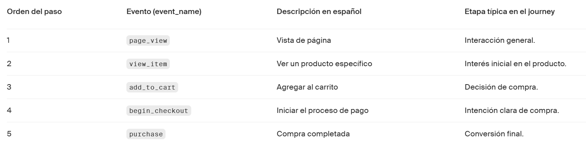
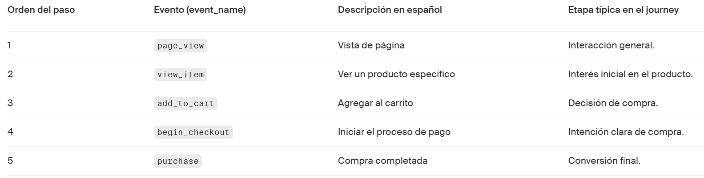

# Sprint 4: Analiza Journeys de usuarios con SQL
🗓️ Fecha de creación: 10 Noviembre 2025  
🗓️ Fecha de actualización: 10 Noviembre 2025  

---
## Capitulo 1: Entendendiendo el user journey y estructurando el análisis
### C1 - Lección 1: Entendiendo un journey en los datos
 

**🎯 Propósito de la lección**

Introducir el user journey como la ruta secuencial de eventos que un usuario recorre hasta (o sin) lograr un objetivo de negocio, y mostrar cómo esa ruta se convierte en embudos medibles con SQL para identificar fricción, eficiencia y oportunidades de mejora.

**🧠 Idea central**

El journey se modela en una tabla de eventos ordenados por tiempo. Medir un journey equivale a construir un embudo (funnel): contar cuántos avanzan entre etapas, cuánto tardan y dónde se detienen, definiendo desde el inicio unidad de análisis (usuario o sesión) y ventana temporal.

**🧩 Conceptos y estructura del análisis**

**Macro vs. Micro-journey**

    - Macro-journey: vista de punta a punta (p. ej., page_view → view_item → add_to_cart → begin_checkout → purchase). Útil para visión global, tasa de conversión final y tiempo total.
    - Micro-journey: tramo específico (p. ej., add_to_cart → purchase). Útil para aislar fricciones concretas y ejecutar mejoras tácticas.

**Dimensiones de análisis**

    - Usuario (user_id): mide conversión “real” (personas únicas). Impacta lealtad, re-compra y cohortes.
    - Sesión (session_id): mide eficiencia de la interfaz en un episodio; detecta pasos redundantes.
    - Evento (event_name): acción puntual que permite diagnósticos finos (scrolls, clicks críticos, errores).

**Requisitos de datos**

    - Timestamps con zona horaria consistente.
    - Identificadores estables (mismo user_id entre etapas).
    - Enum de eventos con definición clara (qué dispara cada uno).

**📊 Métricas clave del embudo (con supuestos y SQL base)**

**Supuesto común:** medición por usuario (ajustar a sesión si el objetivo es UX puntual). Orden por tiempo es obligatorio.

1. **Tasa de conversión (A→B)**

    **SQL (esqueleto):**

    `WITH a AS (`
    `SELECT DISTINCT user_id FROM events WHERE event_name = 'view_item'  AND event_date BETWEEN :d1 AND :d2`
    `),`
    `b AS (`
    `SELECT DISTINCT user_id FROM events WHERE event_name = 'add_to_cart' AND event_date BETWEEN :d1 AND :d2`
    `)`
    `SELECT 100.0 * COUNT(DISTINCT b.user_id) / NULLIF(COUNT(DISTINCT a.user_id),0) AS conv_pct`
    `FROM a LEFT JOIN b ON a.user_id = b.user_id;`

2. **Volumen por etapa**

    `COUNT(DISTINCT user_id)` por evento/etapa dentro del periodo.

3. **Velocidad de conversión (inicio→objetivo)**

    Promedio del tiempo total desde el primer evento hasta purchase. Señala fluidez global.

**Interpretación rápida**

- Conversión alta + tiempo corto ⇒ eficiencia.
- Conversión baja + tiempo alto ⇒ fricción (UI, precio, confianza).
- Volumen alto con conversión baja ⇒ cuello de botella en esa etapa.

**🛠️ “Cómo hacerlo” (procedimiento operativo)**

1. Alinear objetivo de negocio (venta, registro, activación) y definir etapas.
2. Elegir unidad (usuario / sesión) y ventana temporal (día, semana, mes; TZ).
3. Normalizar eventos (diccionario) y ordenar por timestamp.
4. Construir conteos por etapa y tablas A/B; derivar conversión y drop-off.
5. Calcular tiempos entre etapas y velocidad global.
6. Visualizar embudo con volumen y %; destacar el mayor drop-off.
7. Hipótesis sobre causas (precio, latencia, UX) y pruebas (A/B, copy, CU).
8. Iterar: medir después del cambio y comparar.

**Errores comunes**

- ❌ No definir unidad y mezclar usuarios con sesiones ✅ fijar COUNT(DISTINCT user_id) o session_id según el objetivo.
- ❌ Ignorar orden temporal ✅ forzar MIN(event_ts) por etapa y filtrar t_b > t_a.
- ❌ Doble conteo por múltiples acciones del mismo usuario ✅ usar DISTINCT por etapa.
- ❌ Comparar etapas no contiguas (A→C saltando B) ✅ construir pasos adyacentes y luego encadenar.
- ❌ IDs y zonas horarias inconsistentes ✅ normalizar TZ; limpiar IDs antes de los ejemplos.
- ❌ Ejemplos SQL con formato tipográfico (comillas curvas, guion largo) ✅ usar ' y --.

 

### C1 - Lección 2: Identificando eventos y campos en una base de datos
 

**🎯 Propósito de la lección**

- Reconstruir la secuencia de acciones de un usuario.
- Contar usuarios únicos por etapa usando COUNT(DISTINCT ...).
- Introducir segmentación por campos de contexto (p. ej., país o dispositivo) para enriquecer el análisis.

**🧠 Idea central**

Un journey no “viene armado” en la base; se reconstruye enlazando eventos por `user_id`, ordenando por `event_timestamp` y seleccionando los `event_name` que definen el embudo. Con esa base, `COUNT(DISTINCT user_id)` entrega el volumen real de personas que alcanzan cada etapa y permite calcular conversiones y abandono más adelante.

**📦 Dataset y campos clave**

- Tabla: `ecommerce_jan_2021` (una fila = un evento).
- Claves mínimas:
    - `user_id` → quién.
    - `event_timestamp` → cuándo (orden secuencial).
    - `event_name` → qué acción (etapa).
- Contexto (opcionales, pero valiosos):
    - `country`, `traffic_source`, `operating_system` (para segmentar y explicar diferencias).

**🧭 Paso a paso técnico**

1. **Explorar eventos clave**

`SELECT DISTINCT event_name`
`FROM ecommerce_jan_2021;`

2. **Reconstruir la secuencia por usuario**

`SELECT user_id, event_timestamp, event_name`
`FROM ecommerce_jan_2021`
`WHERE event_name IN ('page_view','view_item','add_to_cart','begin_checkout','purchase')`
`ORDER BY user_id, event_timestamp;`

3. **Contar usuarios únicos por etapa**

`SELECT event_name,`
       `COUNT(DISTINCT user_id) AS users`
`FROM ecommerce_jan_2021`
`WHERE event_name IN ('page_view','view_item','add_to_cart','begin_checkout','purchase')`
`-- Recomendación: aplicar el mismo rango temporal en todo el análisis`
`-- AND event_timestamp BETWEEN '2021-01-01' AND '2021-01-31'`
`GROUP BY event_name`
`ORDER BY users DESC;`

4. **Segmentar por contexto (ej., país)**

`SELECT country,`
       `event_name,`
       `COUNT(DISTINCT user_id) AS users`
`FROM ecommerce_jan_2021`
`WHERE event_name IN ('page_view','view_item','add_to_cart','begin_checkout','purchase')`
`GROUP BY country, event_name`
`ORDER BY country, event_name;`

**Errores comunes (y cómo evitarlos)**

- ❌ Contar eventos en lugar de usuarios (COUNT(*) vs COUNT(DISTINCT user_id)).
- ❌ Mezclar rango temporal entre etapas (comparar enero vs todo el histórico).
- ❌ No estandarizar event_name (mayúsculas, espacios, camelCase vs snake_case).
- ❌ Ignorar empates de tiempo y no tener un segundo criterio de orden.
- ❌ Olvidar nulos en user_id o diferencias de zona horaria en event_timestamp.

**Práctica guiada**

1. **Objetivo:** Debes crear una consulta SQL para segmentar y medir la eficiencia de nuestro embudo de ventas digital. Queremos ir más allá de los totales generales agrupando los resultados por país, tipo de evento y por categoría de producto.

**Instrucciones:**

- Seleccionar las columnas country, category y event_name de la tabla ecommerce_jan_2021.
- No uses alias.
- Filtra por los eventos 'page_view', 'view_item', 'add_to_cart', 'begin_checkout','purchase'
- Ordena por country y category de forma ascendente

**Respuesta**

`SELECT country,` 
			`category,` 
			`event_name,`
			`COUNT(DISTINCT user_id)`
`FROM ecommerce_jan_2021`
`WHERE event_name IN ('page_view', 'view_item', 'add_to_cart',`
										`'begin_checkout','purchase')`
`group by country, category, event_name`
`ORDER BY country, category ASC`

2. **Objetivo:** El equipo de mercadeo te pide un listado que muestre  todas las combinaciones de categoría y país, para entender cuales son los dispositivos utilizados en cada país.  

**Instrucciones:**

- Usar DISTINCT para listar todas las combinaciones únicas de category y country (tipo de dispositivo y país).
- Identificar si hay alguna combinación que se de solamente en un país y no en otro.

**Respuesta**

`SELECT distinct category, country`
`FROM ecommerce_jan_2021`

 

### C1 - Lección 3: Validando la calidad de los datos
 

**🎯 Propósito de la lección**

Establecer un protocolo mínimo de aseguramiento de calidad en datos de eventos antes de medir conversión.

Enseñar patrones SQL para detectar y tratar duplicados, eventos faltantes y problemas de tiempo/secuencia.

Documentar hallazgos de calidad con trazabilidad para que análisis posteriores sean confiables y reproducibles.

**🧠 Idea central**

En embudos de conversión, pequeños defectos de calidad (registros duplicados, pasos ausentes o timestamps desordenados) distorsionan conversiones, abandonos y tiempos en etapa. Por eso, antes de construir métricas, la lección guía a validar y corregir la base con consultas SQL simples pero efectivas, y a dejar evidencia escrita del impacto (porcentajes afectados, reglas aplicadas y decisiones de inclusión/exclusión).

**Temáticas trabajadas**

- **Tipos de problemas y su impacto de negocio**

    - Duplicados: inflan ingresos/finalizaciones y la base de cada etapa.
    - Eventos faltantes: rompen la narrativa del funnel (p. ej., purchase sin add_to_cart).
    - Inconsistencias temporales: hacen imposible medir “tiempo en etapa” y análisis por cohortes.

- **Detección de duplicados (clave quién–qué–cuándo)**

    - Conteo por clave:

    SELECT user_id, event_name, event_timestamp, COUNT(*) AS numero_registros
    FROM ecommerce_jan_2021
    GROUP BY user_id, event_name, event_timestamp
    HAVING COUNT(*) > 1
    ORDER BY numero_registros DESC;

- **Dedupe robusto conservando una fila:**

    WITH x AS (
    SELECT *, ROW_NUMBER() OVER(
        PARTITION BY user_id, event_name, event_timestamp
        ORDER BY event_timestamp
    ) AS rn
    FROM ecommerce_jan_2021
    )
    SELECT * FROM x WHERE rn = 1;     -- base deduplicada

- **Eventos faltantes (anti-join entre etapas)**

    - Usuarios con purchase sin add_to_cart:

    WITH compra AS (
    SELECT DISTINCT user_id FROM ecommerce_jan_2021 WHERE event_name='purchase'
    ),
    carrito AS (
    SELECT DISTINCT user_id FROM ecommerce_jan_2021 WHERE event_name='add_to_cart'
    )
    SELECT c.user_id
    FROM compra c
    LEFT JOIN carrito a ON c.user_id = a.user_id
    WHERE a.user_id IS NULL;

- **Coherencia temporal y secuencia**

    - Rango de fechas del dataset:

    SELECT MIN(event_timestamp) AS min_ts, MAX(event_timestamp) AS max_ts
    FROM ecommerce_jan_2021;

    - Orden lógico por usuario (detección de desorden):

    WITH t AS (
    SELECT user_id, event_name, event_timestamp,
            LAG(event_timestamp) OVER (PARTITION BY user_id ORDER BY event_timestamp) AS prev_ts
    FROM ecommerce_jan_2021
    )
    SELECT * FROM t WHERE prev_ts IS NOT NULL AND event_timestamp < prev_ts;

    - Validación de precedencias (p. ej., add_to_cart antes de begin_checkout) con MIN(CASE WHEN …) por usuario.

- Decisiones de tratamiento y documentación

    - Clasificación de duplicados: error de sistema/reintento (eliminar), redondeo de timestamp (ventana), repetición intencional (conservar).
    - Recomendación de nota de zona horaria (normalizar a UTC o guardar offset).
    - Resumen mínimo a registrar: % duplicados, % rutas “paso posterior sin previos”, outliers de tiempo/rango, reglas aplicadas y su impacto en métricas.

**Errores comunes y cómo evitarlos**

- ❌ Contar eventos en vez de usuarios por etapa. ✅ COUNT(DISTINCT user_id) para tasas de avance.
- ❌ Asumir que DISTINCT siempre es seguro. ✅ definir la clave de negocio para dedupe y preferir ROW_NUMBER() si hay columnas adicionales que no deben colapsar.
- ❌ Eliminar automáticamente rutas alternativas (p. ej., promo que salta pasos). ✅ decidir según objetivo; si se incluyen, etiquetar para análisis separado.
- ❌ Ignorar zonas horarias o rangos del dataset. ✅ normalizar a UTC, verificar MIN/MAX(event_timestamp) y chequear mes/año esperados.
- ❌ No medir el impacto del saneamiento. ✅ reportar “3.6% duplicados → +X% sobrestimación en conversión A→B”.
- ❌ No documentar decisiones. ✅ añadir un bloque de “Hallazgos de calidad” accesible al equipo con consultas y criterios aplicados.

**Práctica guiada**

1. **Objetivo:** Tu mismo, vas a completar una validacion de calidad del dataset de e-commerce antes de construir el funnel. 

Detectar si existen duplicados en purchase. Un duplicado es una operación realizada por un mismo usuario a la misma hora y fecha.

**Instrucciones:**

- Muestra las columnas user_id y event_timestamp.
- Cuenta el número de eventos utilizando el alias numero_registros.
- Filtra por tipo de evento purchase.
- Agrupa por user_id , event_timestamp, y event_name
- De esta manera podríamos detectar usuarios que compraron productos en la misma fecha y hora exacta, algo que no debiera suceder o que podría ser un fraude. 

**Respuesta:**

`SELECT user_id,`
        `event_timestamp,`
        `count(*) as numero_registros`
`FROM ecommerce_jan_2021`
`WHERE event_name = 'purchase'`
`GROUP BY user_id, event_timestamp, event_name`

2. **Objetivo:** Quieres analizar que cantidad de productos son agregados por cada usuario al carrito. El objetivo es detectar comportamientos atípicos (por ejemplo, un usuario con miles de productos en su carrito).

**Instrucciones:**

- Muestra los usuarios que tengan el evento add_to_cart.
- Cuenta las veces que agregaron productos al carrito.
- Ordena de forma descendente por el conteo; así podemos ver los casos con números mas altos, primero.

**Respuesta:**

`SELECT `
`user_id,`
`count(*)`
`FROM ecommerce_jan_2021`
`WHERE event_name = 'add_to_cart'`
`GROUP BY user_id`
`ORDER BY count(*) DESC`

 

## Capitulo 2: Construccion de funnels con SQL
### C2 - Lección 1: Extrayendo y filtrando eventos relevantes con CTEs
 

**🎯 Propósito de la lección**

Transformar una consulta suelta de conteos de eventos en un embudo (funnel) claro y ordenado usando CTEs (Common Table Expressions), de forma que cada etapa del journey sea un bloque con nombre y podamos imponer el orden lógico del flujo (registro/entrada → exploración → carrito → checkout → compra).

**🧠 Idea central**

Las CTEs permiten modularizar la query: cada etapa del embudo es un subconjunto con nombre (p. ej., cte_view_item) que devuelve usuarios únicos que alcanzaron esa etapa. Luego, un SELECT final combina esas CTEs para contar usuarios por etapa (con COUNT(DISTINCT user_id)), ordenar el funnel y dejar la consulta legible, mantenible y depurable.

**📚 Temáticas trabajadas**

1. **Por qué CTEs para funnels**

    - Problema inicial: el conteo por event_name sale “desordenado” y mezcla granularidades.
    - Solución: CTEs con WITH nombre_cte AS ( subconsulta ) para separar etapas y documentarlas.

2. **Diseño del embudo y orden explícito**

    - Definir etapas clave y su orden (ej.: page_view → view_item → add_to_cart → begin_checkout → purchase).
    - Imponer el orden en el resultado con ORDER BY CASE … END.

3. **CTE de etapa (patrón base)**

    `WITH cte_view_item AS (`
    `SELECT DISTINCT user_id`
    `FROM ecommerce_jan_2021`
    `WHERE event_name = 'view_item'`
    `)`
    `SELECT COUNT(*) AS usuarios FROM cte_view_item;`

4. **Construcción incremental**

    - Agregar CTEs por cada etapa: cte_add_to_cart, cte_begin_checkout, cte_purchase.
    - SELECT final que combine y ordene:

    `WITH`
    `cte_view_item AS ( ... ),`
    `cte_add_to_cart AS ( ... ),`
    `cte_begin_checkout AS ( ... ),`
    `cte_purchase AS ( ... )`
    `SELECT etapa, usuarios`
    `FROM (`
    `SELECT 'view_item' AS etapa, COUNT(*) AS usuarios FROM cte_view_item`
    `UNION ALL`
    `SELECT 'add_to_cart', COUNT(*) FROM cte_add_to_cart`
    `UNION ALL`
    `SELECT 'begin_checkout', COUNT(*) FROM cte_begin_checkout`
    `UNION ALL`
    `SELECT 'purchase', COUNT(*) FROM cte_purchase`
    `) t`
    `ORDER BY CASE etapa`
    `WHEN 'view_item' THEN 1`
    `WHEN 'add_to_cart' THEN 2`
    `WHEN 'begin_checkout' THEN 3`
    `WHEN 'purchase' THEN 4`
    `END;`

    **Ventaja:** salida legible y en orden del journey.

5. **Granularidad del análisis**

    - Por usuario: usa user_id (lealtad/avance individual).
    - Por sesión: usa session_id (eficiencia de interfaz).
    - Dejar notado en la lección cuál se usa y por qué.

**⚠️ Errores comunes y cómo evitarlos**

- ❌ Contar eventos en vez de usuarios por etapa. ✅ Usa COUNT(DISTINCT user_id) dentro de cada CTE o en el SELECT final para tasas de avance.
- ❌ Confundir “signup” con “session_start”. ✅ Alinea nombres del copy con el filtro real (event_name = 'sign_up' o session_start) y mantenlo consistente en todo el capítulo.
- ❌ Embudo sin orden explícito. ✅ Ordena la salida con ORDER BY CASE etapa … END o con una columna step_order.
- ❌ Granularidad incorrecta (usuario vs sesión). ✅ Define al inicio si el funnel es por usuario o por sesión y ajusta los DISTINCT y joins.
- ❌ CTEs ruidosas (demasiadas columnas / sin DISTINCT). ✅ Mantén cada CTE mínima: SELECT DISTINCT user_id FROM … WHERE event_name = '…'.
- ❌ No documentar cada etapa. ✅ Añade un comentario corto por CTE (qué representa y por qué es necesaria).

**Práctica guiada**

1. **Objetivo:** Aislar a los usuarios que iniciaron sesión para usarlos luego en un funnel. 

La consulta intenta crear una CTE, pero tiene errores de sintaxis.

**Instrucciones:**

- Arregla la CTE y el SELECT final para contar a los usuarios.
- Muestra el conteo con el alias total_usuarios.

**Respuesta:**

    `WITH cte_session_start AS(`
    `SELECT DISTINCT user_id`
    `FROM ecommerce_jan_2021`
    `WHERE event_name = 'session_start'`
    `)`
    `SELECT COUNT(*) AS total_usuarios`
    `FROM cte_session_start;`

2. **Objetivo:** Producto quiere saber cuántos usuarios agregaron al carrito en enero 2021, continuamos con la tabla ecommerce_jan_2021.

**Instrucciones:**

- Crear una CTE llamada cte_add_to_cart que devuelva los usuarios únicos que agregaron un producto al carrito (add_to_cart).
- Escribir el SELECT final que muestre el conteo como total_add_to_cart.

**Respuesta:**

    `WITH cte_add_to_cart AS (`
    `SELECT DISTINCT user_id`
    `FROM ecommerce_jan_2021`
    `WHERE event_name = 'add_to_cart'`
    `)`
    `SELECT COUNT(*) AS total_add_to_cart`
    `FROM cte_add_to_cart;`

 

### C2 - Lección 2: Escribir funnels con CTEs
 

**🎯 Propósito de la lección**

Construir un funnel de usuario con SQL ordenado y modular utilizando CTEs (Common Table Expressions), y comparar dos estrategias para obtener métricas por etapa: subconsultas en el SELECT versus LEFT JOINs entre CTEs, cuidando el conteo correcto de usuarios y la relación entre pasos del embudo.

**🧠 Idea central**

Dividir el embudo en bloques nombrados (CTEs) —p. ej., signup → add_to_cart → purchase—, deduplicar por usuario en cada bloque y luego ensamblarlos en un SELECT final. Las CTEs mejoran legibilidad, prueba, y mantenimiento; los LEFT JOINs suelen ofrecer mejor eficiencia y permiten calcular conversiones encadenadas con menos relecturas.

**Temáticas trabajadas**

1. **CTEs en SQL – sintaxis y patrón mental**

    - **Estructura:** WITH nombre_cte AS ( … ) SELECT …
    - Cada CTE representa una etapa del funnel. Ejemplo base:

    `WITH cte_signup AS (`
    `SELECT DISTINCT user_id`
    `FROM ecommerce_jan_2021`
    `WHERE event_name = 'signup'   -- o 'session_start' (unificar criterio)`
    `),`
    `cte_cart AS (`
    `SELECT DISTINCT user_id`
    `FROM ecommerce_jan_2021`
    `WHERE event_name = 'add_to_cart'`
    `),`
    `cte_purchase AS (`
    `SELECT DISTINCT user_id`
    `FROM ecommerce_jan_2021`
    `WHERE event_name = 'purchase'`
    `)`

    - **Buenas prácticas:** nombres explícitos, comentarios arriba de cada CTE (qué filtra, por qué), y DISTINCT user_id para medir personas, no eventos.

2. **Dos estrategias de salida**

    **A) Subconsultas en el SELECT (más simple de leer):**

    `SELECT`
    `(SELECT COUNT(*) FROM cte_signup)   AS signup_users,`
    `(SELECT COUNT(*) FROM cte_cart)     AS cart_users,`
    `(SELECT COUNT(*) FROM cte_purchase) AS purchase_users;`

    **Ventajas:** claridad y rapidez para explicar. Desventaja: no encadena pasos por sí sola; si hay que estimar conversión A→B, se debe controlar población.

    **B) LEFT JOINs (más eficiente y escalable):**

    `SELECT`
    `COUNT(DISTINCT s.user_id) AS signup_users,`
    `COUNT(DISTINCT c.user_id) AS cart_users,`
    `COUNT(DISTINCT p.user_id) AS purchase_users`
    `FROM cte_signup  s`
    `LEFT JOIN cte_cart     c ON s.user_id = c.user_id`
    `LEFT JOIN cte_purchase p ON s.user_id = p.user_id;`

3. **Conversiones encadenadas (evitar sobreestimación)**

    - Si se quiere conversiones reales A→B, asegura la dependencia entre etapas. Opciones:

    - Restringir CTEs encadenando:

        `cte_cart AS (`
        `SELECT DISTINCT user_id`
        `FROM ecommerce_jan_2021`
        `WHERE event_name = 'add_to_cart'`
            `AND user_id IN (SELECT user_id FROM cte_signup)`
        `)`

    - O calcular intersecciones con joins/INTERSECT para A∩B, B∩C.

4. **Control de duplicados y orden temporal**

    Cada CTE deduplica por usuario. Si necesitas el primer momento de la etapa:

    `SELECT user_id, MIN(event_timestamp) AS first_ts`
    `FROM ecommerce_jan_2021`
    `WHERE event_name = 'add_to_cart'`
    `GROUP BY user_id`

    Esto evita inconsistencias al ordenar journeys y mejora la trazabilidad por usuario.

5. **Rendimiento y mantenibilidad**

    - Índices/particiones o clustering en event_name, user_id, event_timestamp.
    - Para >100M eventos, evaluar APPROX_COUNT_DISTINCT(user_id) si la precisión lo permite.
    - Comentar el SQL y usar una convención: `cte_<etapa>_users`, fechas en WHERE, y nota de supuestos (p. ej., session_start se usa como equivalente a signup).

**Errores comunes y cómo evitarlos**

- ❌ Contar eventos en vez de usuarios por etapa. ✅ Usa COUNT(DISTINCT user_id) o deduplica en cada CTE y luego COUNT(*).
- ❌ Calcular conversión A→B con poblaciones no encadenadas (totales independientes). ✅ Encadena CTEs (IN/joins) o calcula A∩B explícitamente.
- ❌ Inconsistencia de nombres de evento (signup vs session_start). ✅ Unifica el evento o documenta el mapeo (proxy) en el código y el texto.
- ❌ Duplicados por usuario dentro de una etapa. ✅ SELECT DISTINCT user_id y, si importa el orden, MIN(event_timestamp) por usuario.
- ❌ Cambiar a INNER JOIN sin analizar el impacto. ✅ Mantén LEFT JOIN si quieres conservar la población de la etapa A como base del funnel.
- ❌ Diferencias entre conteos con subconsultas y joins sin explicación. ✅ Explica que subconsultas leen varias veces y joins consolidan; valida cardinalidad.
- ❌ Omitir límites temporales. ✅ Filtra el período analizado (ej.: Enero 2021) para comparabilidad.
- ❌ SQL poco legible. ✅ Nombra CTEs por etapa y agrega comentarios breves (“filtra usuarios únicos que …”).

**Práctica guiada**

1. **Objetivo:** Producto quiere medir cuántos usuarios únicos avanzan en el funnel básico.

Continuamos con la tabla `ecommerce_jan_2021`.

**Instrucciones:**

- Crea una CTE para signup con el evento session_start.
- Crea una CTE para add_to_cart.
- Crea una CTE para purchase.
- Muestra en un solo SELECT el conteo de cada etapa.
- Utiliza sub consultas en el SELECT final para realizar los conteos por etapa.

**Respuesta:**

    `WITH cte_signup AS (``
    `SELECT DISTINCT user_id`
    `FROM ecommerce_jan_2021`
    `WHERE event_name = 'session_start'`
    `),`
    `cte_cart AS (`
    `SELECT DISTINCT user_id`
    `FROM ecommerce_jan_2021`
    `WHERE event_name = 'add_to_cart'`
    `),`
    `cte_purchase AS (`
    `SELECT DISTINCT user_id`
    `FROM ecommerce_jan_2021`
    `WHERE event_name = 'purchase'`
    `)`
    `SELECT`
    `(SELECT COUNT(*) FROM cte_signup)   AS signup_users,`
    `(SELECT COUNT(*) FROM cte_cart)     AS cart_users,`
    `(SELECT COUNT(*) FROM cte_purchase) AS purchase_users;`

2. **Objetivo:** Marketing quiere analizar otro funnel:
view_item → begin_checkout → purchase.

**Instrucciones:**

1. Crea 3 CTEs (una por cada evento).
    - cte_view
    - cte_checkout
    - cte_purchase
2. Muestra los conteos de cada etapa en un SELECT final.
3. Utiliza sub consultas en el SELECT final para realizar los conteos por etapa. Usa los siguientes nombres para las columnas de la tabla final:
    - view_users
    - checkout_users
    - purchase_users
4. Identifica en qué etapa se pierden más usuarios.

**Respuesta:**

    `WITH cte_view AS (`
    `SELECT DISTINCT user_id`
    `FROM ecommerce_jan_2021`
    `WHERE event_name = 'view_item'`
    `),`
    `cte_checkout AS (`
    `SELECT DISTINCT user_id`
    `FROM ecommerce_jan_2021`
    `WHERE event_name = 'begin_checkout'`
    `),`
    `cte_purchase AS (`
    `SELECT DISTINCT user_id`
    `FROM ecommerce_jan_2021`
    `WHERE event_name = 'purchase'`
    `)`
    `SELECT`
    `(SELECT COUNT(*) FROM cte_view)     AS view_users,`
    `(SELECT COUNT(*) FROM cte_checkout) AS checkout_users,`
    `(SELECT COUNT(*) FROM cte_purchase) AS purchase_users;`

 

### C2 - Lección 3: Contando usuarios en cada etapa
 

**🎯 Propósito de la lección**

Calcular, con una sola consulta clara y robusta, cuántos usuarios únicos llegan a cada etapa del funnel y qué porcentaje se pierde entre pasos consecutivos (drop-off) para detectar dónde se estrecha el embudo y priorizar mejoras.

**🧠 Idea central**

Modelamos cada paso del funnel como una CTE (WITH … AS …) que guarda usuarios únicos por evento (p. ej., `session_start` → `add_to_cart` → `purchase`). Luego, en el SELECT final:

- contamos usuarios por etapa con COUNT(*) sobre cada CTE;
- calculamos conversión y drop-off entre etapas usando aritmética simple y NULLIF para evitar divisiones por cero;
- opcionalmente, normalizamos el resultado en formato “largo” para reportar etapa por etapa con LAG().

**📚 Temáticas trabajadas**

1. **CTEs por etapa (usuarios únicos)**

    `WITH cte_signup AS (`
    `SELECT DISTINCT user_id`
    `FROM ecommerce_jan_2021`
    `WHERE event_name IN ('session_start','sign_up')`
    `),`
    `cte_cart AS (`
    `SELECT DISTINCT user_id`
    `FROM ecommerce_jan_2021`
    `WHERE event_name = 'add_to_cart'`
    `),`
    `cte_purchase AS (`
    `SELECT DISTINCT user_id`
    `FROM ecommerce_jan_2021`
    `WHERE event_name = 'purchase'`
    `)`

2. **Conteos + drop-off + conversión en una sola salida**

    `SELECT`
    `(SELECT COUNT(*) FROM cte_signup)   AS signup_users,`
    `(SELECT COUNT(*) FROM cte_cart)     AS cart_users,`
    `(SELECT COUNT(*) FROM cte_purchase) AS purchase_users,`

    `-- % que se pierde de signup -> cart`
    `ROUND(`
       `((SELECT COUNT(*) FROM cte_signup) - (SELECT COUNT(*) FROM cte_cart))`
        `/ NULLIF((SELECT COUNT(*) FROM cte_signup), 0.0) * 100, 2`
    `) AS dropoff_after_signup_pct,`

    `-- % que se pierde de cart -> purchase`
    `ROUND(`
        `((SELECT COUNT(*) FROM cte_cart) - (SELECT COUNT(*) FROM cte_purchase))`
        `/ NULLIF((SELECT COUNT(*) FROM cte_cart), 0.0) * 100, 2`
    `) AS dropoff_after_cart_pct,`

    `-- conversiones útiles`
    `ROUND((SELECT COUNT(*) FROM cte_cart) / NULLIF((SELECT COUNT(*) FROM cte_signup), 0.0) * 100, 2)`
        `AS conv_signup_to_cart_pct,`
    `ROUND((SELECT COUNT(*) FROM cte_purchase) / NULLIF((SELECT COUNT(*) FROM cte_cart), 0.0) * 100, 2)`
        `AS conv_cart_to_purchase_pct,`
    `ROUND((SELECT COUNT(*) FROM cte_purchase) / NULLIF((SELECT COUNT(*) FROM cte_signup), 0.0) * 100, 2)`
        `AS conv_signup_to_purchase_pct;`

3. **Buenas prácticas de estabilidad**

- Usa `DISTINCT user_id` dentro de cada CTE para evitar doble conteo.

- Aplica `NULLIF(…,0)` en divisiones y `ROUND` para porcentajes legibles.

- Si tu producto tiene sinónimos de eventos, normalízalos con IN (…).

- Si necesitas asegurar una sola ocurrencia por usuario/etapa, deduplica con `ROW_NUMBER()` por `user_id`, `event_name ORDER BY event_timestamp`.

**Errores comunes y cómo evitarlos**

- ❌ Contar eventos en vez de usuarios por etapa. ✅ Usa COUNT(DISTINCT user_id) dentro de cada CTE.
- ❌ Comparar etapas con ventanas temporales distintas (p. ej., signup en enero y purchase en todo el año). ✅ Filtra el mismo rango temporal para todas las CTE (ej. WHERE event_date BETWEEN '2021-01-01' AND '2021-01-31').
- ❌ No controlar divisiones por cero (embudos con 0 usuarios en la etapa anterior). ✅ Protege con NULLIF(denominador,0) y muestra 0/NULL según tu regla de negocio.
- ❌ Olvidar sinónimos de eventos (session_start vs sign_up). ✅ Unifica con IN ('session_start','sign_up') o crea una CTE de mapeo.
- ❌ Duplicados por múltiples hits válidos del mismo usuario en una etapa. ✅ Forza unicidad por user_id dentro de cada CTE (o toma el primer hit con ROW_NUMBER() y filtra WHERE rn=1).
- ❌ Orden lógico implícito. ✅ Define el orden del funnel explícitamente (stage_order) para que LAG() y los cálculos sean consistentes.

**Práctica guiada**

1. **Objetivo:** Marketing quiere ver el funnel básico de los siguientes pasos: 

add_to_cart → begin_checkout → purchase

**Instrucciones:**

- Calcular el drop-off entre add_to_cart y begin_checkout.
- Calcular el drop-ff entre begin_checkout y purchase

**Respuesta:**

    `WITH cte_cart AS (`
    `SELECT DISTINCT user_id`
    `FROM ecommerce_jan_2021`
    `WHERE event_name = 'add_to_cart'`
    `),`
    `cte_checkout AS (`
    `SELECT DISTINCT user_id`
    `FROM ecommerce_jan_2021`
    `WHERE event_name = 'begin_checkout'`
    `),`
    `cte_purchase AS (`
    `SELECT DISTINCT user_id`
    `FROM ecommerce_jan_2021`
    `WHERE event_name = 'purchase'`
    `)`
    `SELECT`
    `(SELECT COUNT(*) FROM cte_cart)     AS cart_users,`
    `(SELECT COUNT(*) FROM cte_checkout) AS checkout_users,`
    `(SELECT COUNT(*) FROM cte_purchase) AS purchase_users,`
    `((SELECT COUNT(*) FROM cte_cart) - (SELECT COUNT(*) FROM cte_checkout)) * 100`
        `/ NULLIF((SELECT COUNT(*) FROM cte_cart), 0) AS dropoff_after_cart_pct,`
    `((SELECT COUNT(*) FROM cte_checkout) - (SELECT COUNT(*) FROM cte_purchase)) * 100`
        `/ NULLIF((SELECT COUNT(*) FROM cte_checkout), 0) AS dropoff_after_checkout_pct;`

2. **Objetivo:** El equipo de producto quiere identificar en qué punto del recorrido los usuarios interesados dejan de avanzar hacia la compra.

Para ello, construirás un funnel con las etapas iniciales del proceso:

view_item, add_to_cart y begin_checkout.

**Instrucciones:**

Continuamos con la tabla ecommerce_jan_2021.

- Crea tres CTEs que representen las etapas del funnel (cte_view, cte_cart, cte_checkout).
- Muestra el número de usuarios únicos en cada etapa.
- Calcula el porcentaje de abandono (drop-off) entre cada paso del funnel. Usa los alias 
- dropoff_after_view_pct y dropoff_after_cart_pct respectivamente.
- Presenta los resultados en una tabla final que muestre tanto los conteos como los porcentajes.

**Respuesta:**

    `WITH cte_view AS (`
    `SELECT DISTINCT user_id`
    `FROM ecommerce_jan_2021`
    `WHERE event_name = 'view_item'`
    `),`
    `cte_cart AS (`
    `SELECT DISTINCT user_id`
    `FROM ecommerce_jan_2021`
    `WHERE event_name = 'add_to_cart'`
    `),`
    `cte_checkout AS (`
    `SELECT DISTINCT user_id`
    `FROM ecommerce_jan_2021`
    `WHERE event_name = 'begin_checkout'`
    `)`
    `SELECT`
    `(SELECT COUNT(*) FROM cte_view)     AS viewed_products,`
    `(SELECT COUNT(*) FROM cte_cart)     AS added_to_cart,`
    `(SELECT COUNT(*) FROM cte_checkout) AS started_checkout,`
    `((SELECT COUNT(*) FROM cte_view) - (SELECT COUNT(*) FROM cte_cart)) * 100`
        `/ NULLIF((SELECT COUNT(*) FROM cte_view), 0) AS dropoff_after_view_pct,`
    `((SELECT COUNT(*) FROM cte_cart) - (SELECT COUNT(*) FROM cte_checkout)) * 100`
        `/ NULLIF((SELECT COUNT(*) FROM cte_cart), 0) AS dropoff_after_cart_pct;`

 

### C2 - Lección 4: Analizando tasas de conversión y abandono
 

**🎯 Propósito de la lección**

Transformar la salida del funnel en métricas interpretables: usuarios únicos por etapa, conversión entre etapas, drop-off entre etapas y conversión global; y convertir esos números en insights accionables que prioricen mejoras del producto/UX.

**🧠 Idea central**

Con CTEs que representan cada paso del funnel, puedes calcular de forma consistente:

    - Usuarios únicos por etapa (COUNT(*) sobre CTEs con SELECT DISTINCT user_id).
    - Conversión etapa→etapa next/prev * 100.
    - Drop-off etapa→etapa (prev - next)/prev * 100.
    - Conversión acumulada desde el inicio hasta purchase.
    - Luego interpretas: detectas el mayor drop-off, formulas hipótesis (precio, relevancia, fricción), y cierras con un mini-reporte C → F → I (Context, Finding, Insight).

**Temáticas trabajadas**

1. Estandarización del funnel: page_view → view_item → add_to_cart → begin_checkout → purchase. Aclara si el capítulo usará este orden (evita mezclar con session_start/signup).
2. CTEs por etapa con usuarios únicos: SELECT DISTINCT user_id en cada CTE para no contar duplicados.
3. Tabla de conteos: CTE/consulta counts que expone *_users por etapa y sirve de base para todos los cálculos.
4. Conversión entre etapas: ROUND(100.0 * next / NULLIF(prev,0), 1) para cada transición.
5. Drop-off entre etapas: ROUND(100.0 * (1 - next/NULLIF(prev,0)), 1) equivalente a (prev - next)/prev * 100.
6. Conversión acumulada: ROUND(100.0 * purchase_users / NULLIF(page_view_users,0), 2).
7. Formateo y robustez: NULLIF(...,0) para evitar división por cero y ROUND para lecturas limpias.
8. Lectura accionable: detectar el máximo drop-off, proponer hipótesis, priorizar pruebas (pricing, copia, visibilidad CTA, tiempo de carga, etc.).
9. Reporte C→F→I: guía para cerrar cada análisis con un insight ejecutable (no solo números).

**SQL recomendado (limpio, con conversión y abandono)**

    `WITH`
    `cte_page_view AS (`
        `SELECT DISTINCT user_id`
        `FROM ecommerce_jan_2021`
        `WHERE event_name = 'page_view'`
    `),`
    `cte_view_item AS (`
        `SELECT DISTINCT user_id`
        `FROM ecommerce_jan_2021`
        `WHERE event_name = 'view_item'`
    `),`
    `cte_add_to_cart AS (`
        `SELECT DISTINCT user_id`
        `FROM ecommerce_jan_2021`
        `WHERE event_name = 'add_to_cart'`
    `),`
    `cte_begin_checkout AS (`
        `SELECT DISTINCT user_id`
        `FROM ecommerce_jan_2021`
        `WHERE event_name = 'begin_checkout'`
    `),`
    `cte_purchase AS (`
        `SELECT DISTINCT user_id`
        `FROM ecommerce_jan_2021`
        `WHERE event_name = 'purchase'`
    `),`
    `counts AS (`
       `SELECT`
        `(SELECT COUNT(*) FROM cte_page_view)     AS page_view_users,`
        `(SELECT COUNT(*) FROM cte_view_item)     AS view_item_users,`
        `(SELECT COUNT(*) FROM cte_add_to_cart)   AS add_to_cart_users,`
        `(SELECT COUNT(*) FROM cte_begin_checkout) AS begin_checkout_users,`
        `(SELECT COUNT(*) FROM cte_purchase)      AS purchase_users`
    `)`
    `SELECT`
    `page_view_users,`
    `view_item_users,`
    `add_to_cart_users,`
    `begin_checkout_users,`
    `purchase_users,`

    `-- Conversión entre etapas`
    `ROUND(100.0 * view_item_users      / NULLIF(page_view_users,0), 1) AS conv_page_to_item_pct,`
    `ROUND(100.0 * add_to_cart_users    / NULLIF(view_item_users,0), 1)  AS conv_item_to_cart_pct,`
    `ROUND(100.0 * begin_checkout_users / NULLIF(add_to_cart_users,0), 1) AS conv_cart_to_checkout_pct,`
    `ROUND(100.0 * purchase_users       / NULLIF(begin_checkout_users,0), 1) AS conv_checkout_to_purchase_pct,`

    `-- Drop-off entre etapas`
    `ROUND(100.0 * (1 - view_item_users      / NULLIF(page_view_users,0)), 1) AS `dropoff_after_page_view_pct,`
    `ROUND(100.0 * (1 - add_to_cart_users    / NULLIF(view_item_users,0)), 1)  AS `dropoff_after_view_item_pct,`
    `ROUND(100.0 * (1 - begin_checkout_users / NULLIF(add_to_cart_users,0)), 1) AS dropoff_after_cart_pct,`
    `ROUND(100.0 * (1 - purchase_users       / NULLIF(begin_checkout_users,0)), 1) AS `dropoff_after_checkout_pct,

    `-- Conversión global`
    `ROUND(100.0 * purchase_users / NULLIF(page_view_users,0), 2) AS conv_overall_pct`
    `FROM counts;`

**Errores comunes y cómo evitarlos**

- ❌ Contar eventos en vez de usuarios por etapa. ✅ Usa SELECT DISTINCT user_id en cada CTE y cuenta con COUNT(*).
- ❌ Dividir por la etapa incorrecta. ✅ Para transición A→B, el denominador siempre es A.
- ❌ No multiplicar por 100 o no redondear. ✅ ROUND(100.0 * expr, 1) y nombres con sufijo _pct.
- ❌ Identificadores inválidos (guiones) en CTEs. ✅ Usa snake_case: cte_add_to_cart.
- ❌ Mezclar etapas entre lecciones (signup vs page_view). ✅ Declara al inicio el funnel estándar que se usará en L4.
- ❌ Interpretar mal el gráfico. ✅ Rotula explícitamente si el % es drop-off o conversión; idealmente muestra ambos.
- ❌ Ignorar calidad de datos. ✅ Revisa duplicados y secuencia (lección de calidad) antes de calcular métricas.

 

## Capitulo 3: Análisis de retención con cohortes
### C3 - Lección 1: Agrupando usuarios en cohorts
 

 

### C3 - Lección 2: Midiendo la retención en el tiempo
 

 

### C3 - Lección 3: Creando heatmaps de retención
 

 

### C3 - Lección 4: Segmentando la retención por atributos de usuario
 

 

## Capitulo 4: Modelado de escenarios e impacto en negocio
### C4 - Lección 1: Pruebas A/B en funnels y simulando mejoras
 

 

### C4 - Lección 2: Estimando el impacto en métricas de negocio
 

 

### C4 - Lección 3: Comparando escenarios entre segmentos
 

 

### C4 - Lección 4: Visualización de Embudos para los Stakeholders
 

 