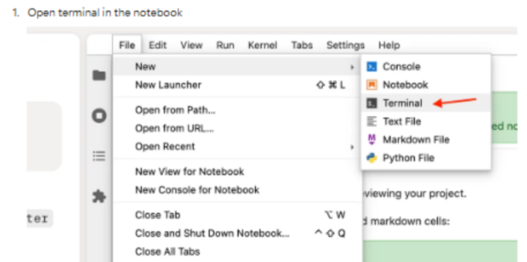

# How to Reset the Project to Its Most Recent Version

This is a procedure to reset the project version that loads when entering any sprint, in order to get the most updated version.

You can use this method on any sprint or notebook that needs to be restarted.

## 🔄 Steps to Reset the Project

From the section where the project is located:

### 1. Open the terminal: `File >> New >> Terminal`

### 2. Type the command `rm -rf /app/* /app/.*` and press **Enter**:

### 3. Click on `File >> Shut Down`

### 4. Refresh the page

✅ Done! After these steps, you’ll see the most recent version of the project in your environment.

💡 You can use this procedure anytime you need to start fresh in a sprint or notebook.

---

# Cómo resetear el pryecto a su versión más reciente

Procedimiento para resetear la versión del proyecto que aparece al entrar a cualquier sprint, con el objetivo de cargar la versión más actualizada.

Este método se puede aplicar en cada sprint o notebook que necesite reiniciarse.

## 🔄 Pasos para resetear el proyecto

Desde la sección donde se encuentra el proyecto:
### 1. Abre la terminal: `File >> New >> Terminal`

### 2. Escribe el comando  `rm -rf /app/* /app/.*` y presionar **Enter**:

### 3. Dar clic en `File >> Shut Down`

### 4. Actualizar pagina

✅ ¡Listo! Con estos pasos verás la versión más reciente del proyecto en tu entorno.

💡 Puedes usar este procedimiento cada vez que necesites comenzar desde cero en un sprint o notebook.