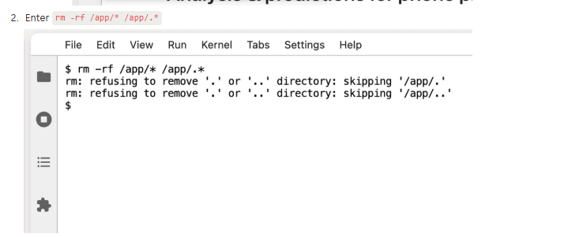
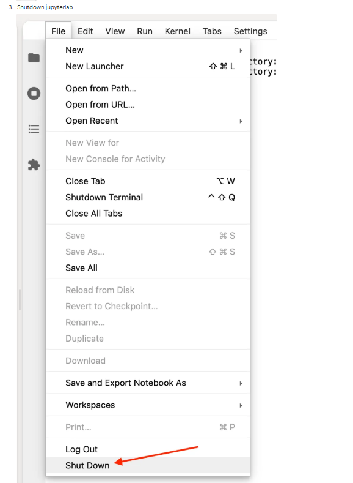

# How to Reset the Project to Its Most Recent Version
Cómo resetear el proyecto a su versión más reciente

Como reiniciar o projeto para a sua versão mais recente

---

💡 You can use this procedure anytime you need to restart a project.
- Puedes usar este procedimiento cada vez que necesites comenzar desde cero un proyecto.
- Você pode usar este procedimento sempre que precisar reiniciar um projeto.
  

## 🔄 Steps to Reset the Project
### 1.  Open the project, then open the terminal: `File >> New >> Terminal`
- Abrir el proyecto y luego abrir la terminal: `File >> New >> Terminal`
- Abrir o projeto e depois abrir o terminal: `File >> New >> Terminal`

### 2. Type the command `rm -rf /app/* /app/.*` and press **Enter**:
- Escribir el comando `rm -rf /app/* /app/.*` y presionar **Enter**
- Digitar o comando `rm -rf /app/* /app/.*` e pressionar **Enter**
 

### 3. Click on `File >> Shut Down`
- Dar clic en `File >> Shut Down`
- Clicar em `File >> Shut Down`

### 4. Refresh the page
- Actualizar la página
- Atualizar a página

--- 
✅ Done! After these steps, you’ll see the most recent version of the project in your environment.
- ¡Listo! Con estos pasos verás la versión más reciente del proyecto en tu entorno.
- Pronto! Com esses passos, você verá a versão mais recente do projeto no seu ambiente.