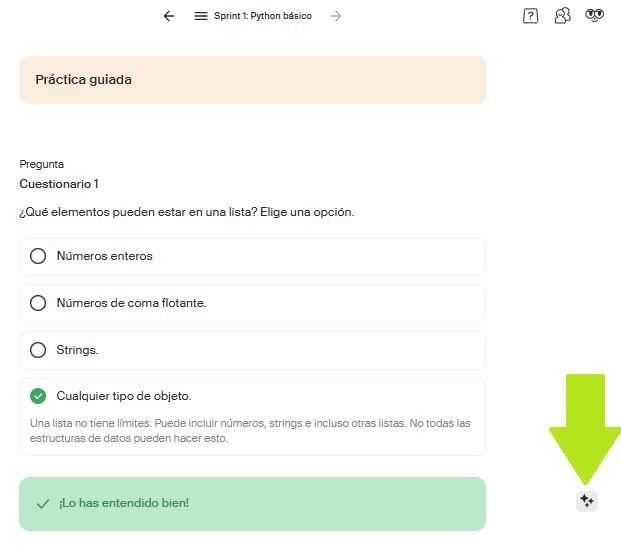
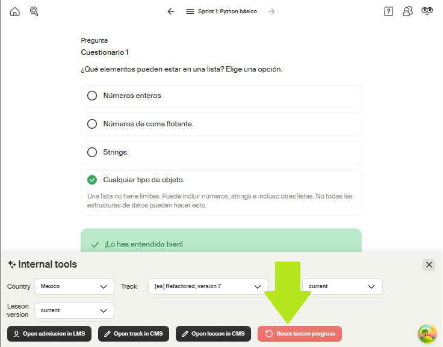

# How to Reset an Exercise or quiz
Cómo reiniciar un ejercicio o cuestionario

Como reiniciar um exercício ou questionário

---  

1. Go to the section you want to restart and click on the stars icon.
- Ir a la lección que deseas reiniciar y dar clic en el icono de las estrellitas.
- Ir para a lição que deseja reiniciar e clicar no ícone das estrelinhas.
  

2. Click the red `Reset lesson progress` button
- Dar clic en el botón rojo de `Reset lesson progress`
- Clicar no botão vermelho `Reset lesson progress`

